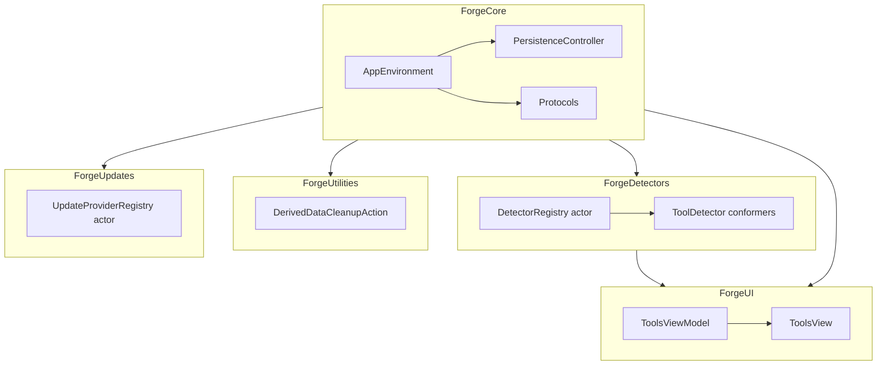

# Forge Architecture Decision Records

> A record of the consequential decisions that shaped Forge. Each entry follows the same format: context, decision, rationale, alternatives, consequences, and references.

## ADR-001: Use SwiftData over Core Data / GRDB / raw SQLite

**Date**: 2026-06-26  
**Status**: Accepted  
**Context**: Forge needs to persist detected tool metadata on macOS 14+. We wanted a persistence layer that integrates natively with SwiftUI and requires minimal boilerplate.  
**Decision**: We chose SwiftData as the persistence framework, with `ToolRecord` and `DetectionRun` defined as `@Model` classes in `ForgeCore`.  
**Rationale**:
- Native SwiftUI observation and `@Query` support reduce UI plumbing.
- Type-safe model definitions avoid manual schema migration code for additive changes.
- Apple platforms are moving toward SwiftData as the preferred persistence API.

**Alternatives considered**:
- **Core Data**: Rejected because it requires more boilerplate (`NSManagedObject` subclasses, manual context threading) and does not integrate with SwiftUI as cleanly.
- **GRDB**: Rejected because it adds a third-party dependency and requires SQL knowledge for migrations.
- **Raw SQLite**: Rejected because it is too low-level and error-prone for a small team.

**Consequences**:
- Positive: Less code, automatic model observation, future-ready.
- Negative: SwiftData is newer than Core Data; some advanced migration and performance tooling is less mature.

**References**: `Packages/ForgeCore/Sources/ForgeCore/ToolRecord.swift:7`, `Packages/ForgeCore/Sources/ForgeCore/PersistenceController.swift:5`

## ADR-002: Use Swift Package Manager (5 local packages) over a single Xcode project

**Date**: 2026-06-26  
**Status**: Accepted  
**Context**: A monolithic Xcode project becomes hard to navigate and test as features multiply. We wanted clear module boundaries and independent testability.  
**Decision**: Split the app into five local Swift packages: `ForgeCore`, `ForgeDetectors`, `ForgeUI`, `ForgeUtilities`, and `ForgeUpdates`.  
**Rationale**:
- Packages enforce explicit dependencies; cyclic imports are impossible.
- Each package can be built and tested in isolation with `swift build` and `swift test`.
- Boundaries map to team ownership: detectors, UI, cleanup, and updates can evolve independently.

**Alternatives considered**:
- **Single Xcode project with groups**: Rejected because it does not enforce dependency boundaries and encourages cross-imports.
- **One package per app target**: Rejected because it still bundles unrelated code together.
- **Remote packages from day one**: Rejected because local packages are faster to iterate on and require no versioning overhead at this stage.

**Consequences**:
- Positive: Faster incremental builds, clearer separation, easier testing.
- Negative: More `Package.swift` files to maintain; Xcode project wiring requires `xcodeproj` gem scripts.

**References**: `Packages/*/Package.swift`

## ADR-003: Use the actor model for DetectorRegistry (reentrancy safety)

**Date**: 2026-06-26  
**Status**: Accepted  
**Context**: `DetectorRegistry` maintains mutable state (`detectors: [ToolID: any ToolDetector]`) and is accessed from both the UI and background scan tasks.  
**Decision**: Define `DetectorRegistry` as a Swift `actor`.  
**Rationale**:
- Actors serialize mutable-state access and eliminate data races at compile time.
- The `Sendable` requirements push detector implementations to be thread-safe by design.
- Actors fit naturally with Swift Concurrency's `await` model.

**Alternatives considered**:
- **Class + `NSLock`**: Rejected because it is error-prone and does not integrate with Swift Concurrency's isolation checking.
- **Value-type registry copied on every mutation**: Rejected because detectors are reference-captured closures/processes; copying the registry does not isolate the detectors themselves.

**Consequences**:
- Positive: Compile-time race safety, clear asynchronous API.
- Negative: All calls require `await`, which adds small syntactic overhead in UI code.

**References**: `Packages/ForgeDetectors/Sources/ForgeDetectors/DetectorRegistry.swift:14`

## ADR-004: Use withTaskGroup for concurrent scan fan-out

**Date**: 2026-06-26  
**Status**: Accepted  
**Context**: Detecting tools involves shelling out to multiple binaries, each with independent I/O. Running them sequentially would make the UI unresponsive.  
**Decision**: Use `withTaskGroup(of: DetectionResult.self)` inside `DetectorRegistry.scanAll()` to run detectors concurrently.  
**Rationale**:
- `withTaskGroup` creates structured concurrency: child tasks are cancelled automatically when the parent scope exits.
- A single broken detector cannot crash the group because errors are caught and converted to `DetectionResult.failed`.
- Results are sorted afterward so the UI sees a stable order.

**Alternatives considered**:
- **Grand Central Dispatch + `DispatchGroup`**: Rejected because it lacks structured concurrency and cancellation.
- **`Task.init` per detector stored in an array**: Rejected because unstructured tasks are harder to cancel and reason about.

**Consequences**:
- Positive: Scans are fast and safe; cancellation is cooperative and scoped.
- Negative: Task group result order is non-deterministic; we must explicitly sort before returning.

**References**: `Packages/ForgeDetectors/Sources/ForgeDetectors/DetectorRegistry.swift:36`

## ADR-005: Use protocol-based DI via AppEnvironment slots (any ProtocolType existentials)

**Date**: 2026-06-26  
**Status**: Accepted  
**Context**: ViewModels and services need dependencies such as the detector registry and persistence controller, but we want to avoid concrete coupling.  
**Decision**: Expose existential protocol slots in `AppEnvironment` (e.g., `var detectorRegistry: any DetectorRegistryProtocol`).  
**Rationale**:
- Existentials let us inject mocks, stubs, and live implementations without changing call sites.
- `AppEnvironment` is the single composition root; no other type creates dependencies.
- `Sendable` protocols preserve Swift Concurrency safety.

**Alternatives considered**:
- **Concrete global singletons**: Rejected because they prevent testing in isolation.
- **Generic environment with associated types**: Rejected because associated types would propagate through every ViewModel and complicate previews.
- **Service locator**: Rejected because it is stringly-typed and error-prone.

**Consequences**:
- Positive: Testable, composable, explicit dependencies.
- Negative: Existentials have a small runtime cost and slightly less static type information than generics.

**References**: `Packages/ForgeCore/Sources/ForgeCore/AppEnvironment.swift:9`, `AppEnvironment.swift:23`

## ADR-006: ForgeUI depends ONLY on ForgeCore (strict module boundary)

**Date**: 2026-06-26  
**Status**: Accepted  
**Context**: UI packages often accrue dependencies on every feature module, which destroys build parallelism and test isolation.  
**Decision**: `ForgeUI` declares a dependency only on `ForgeCore`. All UI-facing types are defined or re-exported through `ForgeCore`.  
**Rationale**:
- The UI never needs to know how detectors or cleanup actions are implemented.
- Designers can work in `ForgeUI` without triggering builds of detector-specific code.
- It guarantees that UI tests remain fast and do not spawn subprocesses.

**Alternatives considered**:
- **UI depends on ForgeDetectors and ForgeUtilities**: Rejected because it couples rendering to implementation details.
- **Shared DTO package plus UI package**: Rejected because `ForgeCore` already serves as the shared DTO package.

**Consequences**:
- Positive: Fast UI builds, strict layering, reusable UI components.
- Negative: New UI-facing value types must be added to `ForgeCore` first.

**References**: `Packages/ForgeUI/Package.swift`, `Packages/ForgeUI/Sources/ForgeUI/ViewModels/ToolsViewModel.swift:7`

## ADR-007: TrashOnly as a marker protocol with NO methods

**Date**: 2026-06-26  
**Status**: Accepted  
**Context**: Cleanup actions must never permanently delete user files. We needed a compile-time signal that an action is safe by design.  
**Decision**: Define `TrashOnly` as an empty marker protocol (`public protocol TrashOnly: Sendable {}`).  
**Rationale**:
- A marker protocol is impossible to enforce mechanically, but it is highly visible in code review.
- It documents the safety contract right on the type declaration.
- It avoids inventing a fake API that would not actually prevent destructive calls.

**Alternatives considered**:
- **Protocol with required `trash()` method**: Rejected because the method signature alone does not prevent a conforming type from also calling `removeItem` elsewhere.
- **Runtime safety wrapper**: Rejected because it adds indirection without adding real protection.
- **Code-review-only policy**: Rejected because a marker protocol makes the policy explicit in the type system.

**Consequences**:
- Positive: Clear intent, low ceremony.
- Negative: Enforcement is social, not mechanical; future work may add a runtime invariant.

**References**: `Packages/ForgeCore/Sources/ForgeCore/CleanupAction.swift:30`, `Packages/ForgeUtilities/Sources/ForgeUtilities/DerivedDataCleanupAction.swift:8`

## ADR-008: DetectionResult.failed factory to flatten per-detector errors

**Date**: 2026-06-26  
**Status**: Accepted  
**Context**: A scan runs many detectors. If one fails, we still want results for the others and a uniform return type for the UI.  
**Decision**: Provide `DetectionResult.failed(toolId:error:)` and call it from `DetectorRegistry.scanAll()` for every caught error.  
**Rationale**:
- A flat `[DetectionResult]` is easier for SwiftUI to iterate than a nested `Result` type.
- Failed results still carry a `healthChecks` entry explaining the failure.
- One broken detector cannot abort the whole scan.

**Alternatives considered**:
- **Return `[Result<DetectionResult, DetectionError>]`**: Rejected because it forces every UI consumer to unwrap two-level results.
- **Throw on first failure**: Rejected because it would make scans brittle in environments with partially installed tools.

**Consequences**:
- Positive: Robust scans, simple UI consumption.
- Negative: Callers must inspect `healthChecks` to distinguish failure from success.

**References**: `Packages/ForgeDetectors/Sources/ForgeDetectors/DetectionResult.swift:42`, `Packages/ForgeDetectors/Sources/ForgeDetectors/DetectorRegistry.swift:47`

## ADR-009: Static storeURL on PersistenceController (~/Library/Application Support/Forge.store)

**Date**: 2026-06-26  
**Status**: Accepted  
**Context**: The app needs a predictable location for the SwiftData store so users and support can find, back up, or delete it.  
**Decision**: Expose `PersistenceController.storeURL` as a static constant pointing to `~/Library/Application Support/Forge.store`.  
**Rationale**:
- A static URL is discoverable and easy to document.
- macOS convention places per-app data in `~/Library/Application Support`.
- Tests can initialize `PersistenceController(inMemory: true)` to bypass disk entirely.

**Alternatives considered**:
- **Injected URL on every init**: Rejected because it complicates `AppEnvironment.live()` and the common case is always the same path.
- **Store inside the app container**: Rejected because Forge v1 is not sandboxed, and a known user path is more supportable.

**Consequences**:
- Positive: Predictable location, simple backup instructions, easy testing override.
- Negative: The path is hard-coded; moving it later requires a migration.

**References**: `Packages/ForgeCore/Sources/ForgeCore/PersistenceController.swift:20`

## ADR-010: NodeDetector uses injectable CommandRunner protocol

**Date**: 2026-06-26  
**Status**: Accepted  
**Context**: Detectors need to run subprocesses, but tests cannot depend on tools being installed on every machine.  
**Decision**: Define `CommandRunner` as a protocol and inject it into `NodeDetector`.  
**Rationale**:
- Tests replace `ProcessCommandRunner` with `MockCommandRunner` to verify parsing.
- The protocol boundary isolates process-launching logic from version-parsing logic.
- Detectors remain deterministic and fast in CI.

**Alternatives considered**:
- **Static helper that shells out**: Rejected because it is not testable without environment-specific binaries.
- **Protocol with a closure**: Rejected because a custom protocol is more explicit and supports richer diagnostics (stdout, stderr, exit code).

**Consequences**:
- Positive: Fast, deterministic detector tests; clear separation of concerns.
- Negative: Every detector must accept and store a `CommandRunner` dependency.

**References**: `Packages/ForgeDetectors/Sources/ForgeDetectors/Tools/Node/NodeDetector.swift:6`, `NodeDetector.swift:62`

## ADR-011: Use the Ruby `xcodeproj` gem for pbxproj manipulation (not sed/edit)

**Date**: 2026-06-26  
**Status**: Accepted  
**Context**: Xcode project files are fragile XML-like property lists. Manual edits often corrupt references or produce merge conflicts.  
**Decision**: Manipulate `project.pbxproj` through Ruby scripts using the `xcodeproj` gem.  
**Rationale**:
- The gem validates object references and UUIDs.
- Scripts are idempotent and reviewable.
- Manual `sed` or hand-editing is banned because it cannot validate the project graph.

**Alternatives considered**:
- **Hand-edit `project.pbxproj`**: Rejected because it is error-prone and hard to review.
- **Tuist / XcodeGen**: Rejected because they add a new build-time dependency and are overkill for five local packages.

**Consequences**:
- Positive: Reliable project structure, reproducible diffs.
- Negative: Team members need Ruby + `xcodeproj` installed to regenerate the project.

**References**: `create_test_target.rb`, `fix_test_target.rb`

## ADR-012: SPM test targets require an umbrella PBXNativeTarget pattern

**Date**: 2026-06-26  
**Status**: Accepted  
**Context**: SPM `.testTarget`s are not exported as products, so `xcodebuild test` inside the Xcode project cannot see them directly.  
**Decision**: Wrap test sources that must run via `xcodebuild` in an umbrella `PBXNativeTarget` inside `Forge.xcodeproj`.  
**Rationale**:
- We need `xcodebuild test` for CI and for tests that depend on app-level wiring.
- The umbrella target links the test source and the library product it exercises.
- The pattern is localized and can be removed if SPM ever exposes test targets to Xcode.

**Alternatives considered**:
- **Run all tests with `swift test` only**: Rejected because `ForgeUtilitiesTests` relies on the Xcode project scheme for discovery.
- **Duplicate test targets as SPM products**: Rejected because SPM does not allow exporting test targets as products.

**Consequences**:
- Positive: CI can run all tests through a single `xcodebuild test` invocation.
- Negative: Extra project maintenance; adding a new umbrella test target requires a script change.

**References**: `Forge.xcodeproj/project.pbxproj:121`, `Forge.xcodeproj/xcshareddata/xcschemes/Forge.xcscheme:35`

## ADR-013: PersistenceController is @MainActor

**Date**: 2026-06-26  
**Status**: Accepted  
**Context**: SwiftData contexts are not thread-safe; `ModelContext` must be used on the actor it was created on. The UI updates on the main actor.  
**Decision**: Mark `PersistenceController` as `@MainActor` and expose `mainContext` for the UI.  
**Rationale**:
- Aligns with SwiftUI's main-actor runtime.
- Prevents accidental cross-thread model access.
- Matches the `@MainActor` requirement on `PersistenceControllerProtocol.save` and `fetchAll`.

**Alternatives considered**:
- **Background actor + context**: Rejected because it adds complexity and most persistence calls originate from the UI.
- **No actor annotation**: Rejected because it would allow unsafe concurrent access to the model context.

**Consequences**:
- Positive: Safe, simple SwiftData usage.
- Negative: Background scan code must `await MainActor.run` before persisting results.

**References**: `Packages/ForgeCore/Sources/ForgeCore/PersistenceController.swift:5`

## ADR-014: NoOp defaults in AppEnvironment.live() so the app can launch before every package is wired

**Date**: 2026-06-26  
**Status**: Accepted  
**Context**: The scaffold is built incrementally. At any given commit, one or more packages may be interface-only. The app must still launch.  
**Decision**: `AppEnvironment.live()` uses `NoOpDetectorRegistry`, `NoOpPersistenceController`, `NoOpCleanupServiceRegistry`, and `NoOpUpdateProviderRegistry` as defaults, preferring real implementations when they are supplied.  
**Rationale**:
- The app can be run from Xcode even when detectors or cleanup are stubs.
- No-op conformers are private to `AppEnvironment.swift` and cannot leak into production by accident.
- The pattern supports incremental wiring without compilation errors.

**Alternatives considered**:
- **Require all dependencies at launch**: Rejected because it would block UI development until every package was implemented.
- **Optional environment properties**: Rejected because optionals propagate nil-checks through every ViewModel.

**Consequences**:
- Positive: Incremental development, always-launchable app.
- Negative: It is possible to forget to wire a live dependency and ship a silently no-op feature.

**References**: `Packages/ForgeCore/Sources/ForgeCore/AppEnvironment.swift:112`, `AppEnvironment.swift:119`

## ADR-015: UpdateProviderRegistry ships as interface-only (3 stubs throw .notImplemented)

**Date**: 2026-06-26  
**Status**: Accepted  
**Context**: Update checking requires network access and vendor-specific parsing. It is not needed for the v1 scaffold.  
**Decision**: Define `UpdateProvider` and `UpdateProviderRegistry` interfaces with three stub conformers (`GitHubReleasesProvider`, `HomebrewFormulaProvider`, `VendorPlistProvider`) that throw `UpdateProviderError.notImplemented`.  
**Rationale**:
- The architecture slot exists so the UI and AppEnvironment can be wired correctly.
- Stubs make the boundary testable and demonstrate the intended shape.
- Network-dependent logic is deferred until detectors and cleanup are stable.

**Alternatives considered**:
- **Implement real network providers now**: Rejected because it adds API keys, rate limits, and parsing complexity too early.
- **Omit update checking entirely**: Rejected because the architecture should anticipate the feature rather than retrofit it later.

**Consequences**:
- Positive: Clean extension point, no v1 maintenance burden.
- Negative: The update UI is non-functional until Phase 5+.

**References**: `Packages/ForgeUpdates/Sources/ForgeUpdates/UpdateProvider.swift:8`, `Packages/ForgeUpdates/Sources/ForgeUpdates/UpdateProviderRegistry.swift:6`

## Future scalability

The 15 decisions above form a stable foundation. As Forge grows, the following patterns will be extended rather than replaced:

- **SwiftData**: Migration to multi-model schemas (e.g., `CleanupRun`, `UpdateCache`) will use additive-only changes.
- **Packages**: New subsystems (menu bar, Spotlight, plugins) will become new local packages following the same dependency direction.
- **Protocols**: New detectors, cleanup actions, and update providers will plug into existing protocol slots.
- **Actors**: Any future registry with mutable shared state will be modeled as an actor.
- **pbxproj**: The `xcodeproj` script workflow will remain mandatory regardless of project size.

## Risks

| Risk | Impact | Mitigation |
|---|---|---|
| Marker protocol `TrashOnly` is not mechanically enforced | High | Code review + future runtime invariant; see [TESTING.md](./TESTING.md) for fixture-based tests that assert behavior. |
| `AppEnvironment.live()` no-op defaults hide missing wiring | Medium | Integration tests assert real registries are passed in `ForgeApp.swift`; checklists in [ROADMAP.md](./ROADMAP.md). |
| SwiftData migration tooling is immature | Medium | Additive-only schema changes; in-memory tests validate migrations before release. |
| Umbrella test target adds maintenance overhead | Low | Documented in [TESTING.md](./TESTING.md); regenerated by scripts, not hand-edited. |
| Existential protocol slots obscure some compile-time guarantees | Low | Favor small, focused protocols and validate behavior through tests. |

For operational risks, see [OPERATIONS.md](./OPERATIONS.md). For the implementation schedule, see [ROADMAP.md](./ROADMAP.md).
