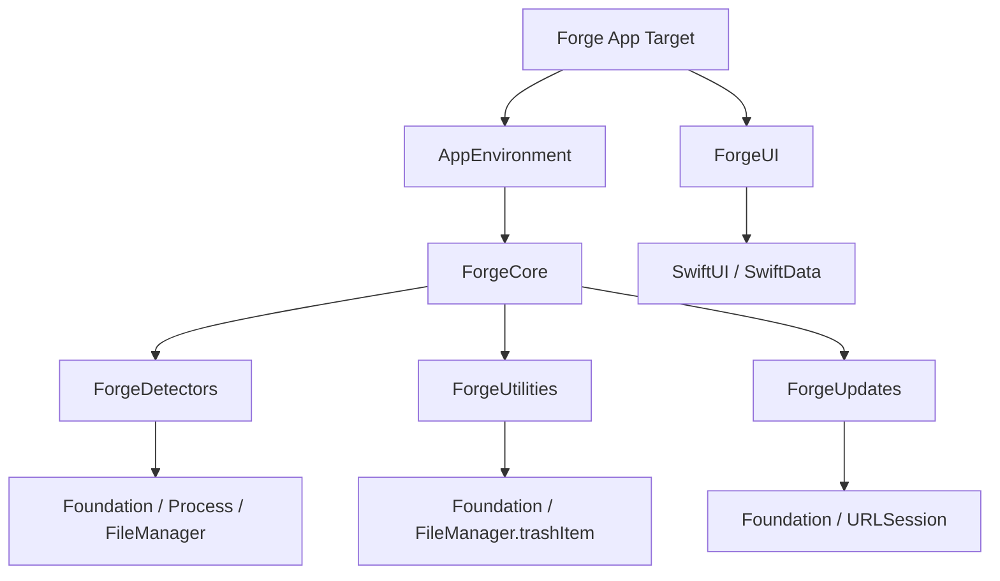
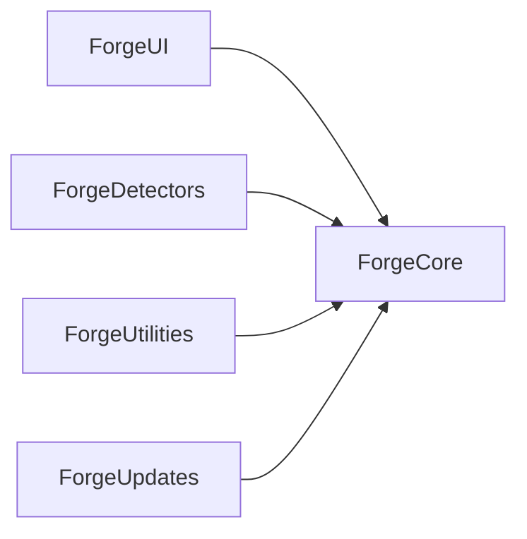
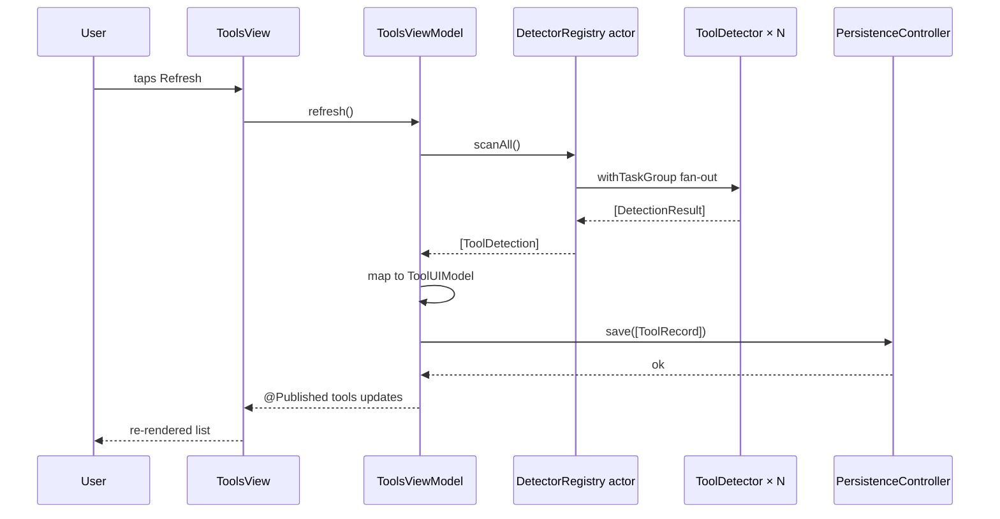
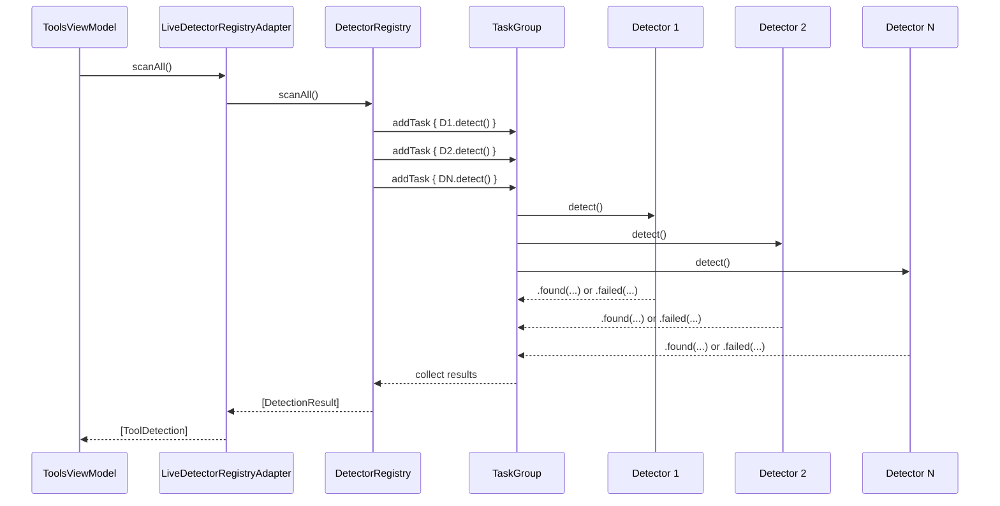
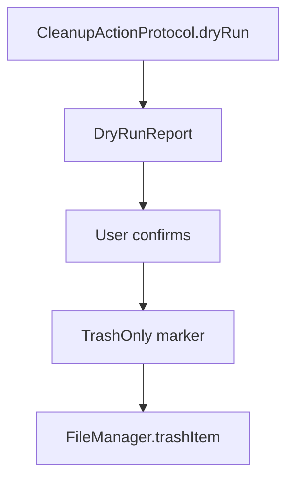

# Forge — Architecture Guide

> This document is the authoritative architecture record for Forge. It explains why the system is shaped the way it is, where the boundaries are, and how to extend it without breaking those boundaries.

## System Overview

Forge is a native macOS app that discovers developer tools, reports their health, and performs safe cleanup. The architecture is organized around five local Swift packages: `ForgeCore`, `ForgeDetectors`, `ForgeUI`, `ForgeUtilities`, and `ForgeUpdates`. The app target wires these packages together at launch through `AppEnvironment`, a dependency-injection container defined in `ForgeCore`.

We chose SwiftUI and MVVM because the interface is primarily data-driven lists, status glyphs, and confirmation sheets. SwiftUI's `ObservableObject`/`@Published` gives us automatic view invalidation while keeping Views as pure functions of state. SwiftData is the persistence layer because it is the first-party object graph for macOS 14, integrates cleanly with `@Query`, and reduces Core Data boilerplate. Swift Concurrency is the concurrency model because it gives us structured cancellation, actor isolation, and type-safe async boundaries.

The package split is deliberate. `ForgeCore` changes slowly and is depended on by everyone; it owns shared types and protocols. `ForgeDetectors`, `ForgeUtilities`, and `ForgeUpdates` are concrete implementations that can evolve independently. `ForgeUI` depends only on `ForgeCore` through protocol abstractions, so changes to detector internals never recompile the UI layer. This separation is enforced by SPM dependency declarations, not by convention.

Direct distribution as a notarized `.dmg` keeps the app unsandboxed, which is required for scanning arbitrary install paths, reading `~/.nvm` and `~/.config`, and moving items to Trash. We rejected the Mac App Store because sandboxing would block these operations or require unsustainable temporary entitlements.

## Layer Diagram



The app target owns the lifecycle. `ForgeApp.swift` constructs the concrete `DetectorRegistry` actor, registers `NodeDetector`, wraps the actor in `LiveDetectorRegistryAdapter`, and passes it to `AppEnvironment.live()`. The UI layer receives the environment through the SwiftUI environment object and through constructor injection into `ToolsViewModel`.

## Module Dependency Graph



`ForgeCore` is the only package with no internal package dependencies. Every arrow points inward. We rejected a bidirectional graph (e.g., UI depending directly on Detectors) because it would couple the interface to detector internals and make testing impossible without importing the entire detector package.

The protocol boundary in `ForgeCore` is the only contract the UI sees:

- `DetectorRegistryProtocol` at `Packages/ForgeCore/Sources/ForgeCore/AppEnvironment.swift:13`
- `PersistenceControllerProtocol` at `Packages/ForgeCore/Sources/ForgeCore/AppEnvironment.swift:24`
- `CleanupServiceRegistryProtocol` at `Packages/ForgeCore/Sources/ForgeCore/AppEnvironment.swift:35`
- `UpdateProviderRegistryProtocol` at `Packages/ForgeCore/Sources/ForgeCore/AppEnvironment.swift:42`
- `CleanupActionProtocol` and `TrashOnly` at `Packages/ForgeCore/Sources/ForgeCore/CleanupAction.swift:8`
- `ToolDetectorProtocol` at `Packages/ForgeCore/Sources/ForgeCore/AppEnvironment.swift:68`

## MVVM Data Flow

When the user taps Refresh, the following sequence occurs:



`ToolsViewModel` is `@MainActor` and owns `@Published` state. It calls `registry.scanAll()`, maps the returned `ToolDetection` values to `ToolUIModel`, persists `ToolRecord` values, and publishes the sorted array. Sorting uses `localizedStandardCompare` so "Xcode" appears before "xcodebuild" and version numbers sort naturally. The full implementation is at `Packages/ForgeUI/Sources/ForgeUI/ViewModels/ToolsViewModel.swift:28`.

We chose constructor injection over `@EnvironmentObject` for the ViewModel because it makes previews and tests trivial: pass a stub registry and a stub persistence controller. The environment object is used only to propagate the live environment down the view tree.

## Detector Scan Sequence Diagram

The `DetectorRegistry` actor runs every registered detector concurrently. Per-detector errors are swallowed and converted into `DetectionResult.failed(toolId:error:)` entries so one broken detector cannot abort the whole scan.



The default timeout is 15 seconds per detector. We chose a single shared timeout rather than per-detector timeouts because it keeps the registry API simple and because 15 seconds is generous enough for slow disk enumerations while still preventing indefinite hangs. If a future detector legitimately needs more time, we can add a `timeout` parameter to `ToolDetector` without breaking existing conformers.

The dual API is intentional:

- `scanAll()` returns `[DetectionResult]` — flat, uniform, easy for UI and persistence to consume.
- `scanAllTyped()` returns `[ToolID: Result<DetectionResult, DetectionError>]` — preserves the success/failure discriminator for callers that need to branch explicitly.

We rejected returning `Result` from `scanAll()` because every consumer would have to unwrap the same `Result` wrapper for the common case where failure is already encoded inside `DetectionResult`.

## Swift Concurrency Model

Forge uses Swift Concurrency throughout. The isolation map is:

| Layer | Isolation | Rationale |
| ----- | --------- | --------- |
| `ToolsViewModel` | `@MainActor` | owns `@Published` state; UI updates must happen on main thread |
| `AppEnvironment` | `@MainActor` | stored in SwiftUI environment; must be main-actor bound |
| `PersistenceController` | `@MainActor` | SwiftData `mainContext` is main-thread only |
| `DetectorRegistry` | actor | mutable detector map; scan orchestration must be reentrancy-safe |
| `ToolDetector.detect()` | nonisolated or custom actor | I/O work should not block main actor |
| `CleanupAction.dryRun()` | nonisolated or custom actor | filesystem enumeration can be expensive |
| `LiveDetectorRegistryAdapter` | `@MainActor` | bridges actor to protocol slot stored in environment |

`DetectorRegistry` is an actor rather than a class with a private queue because actors give us compiler-enforced isolation and reentrancy-safe `async` methods. The registry's mutable `detectors` dictionary is never accessed outside the actor. We rejected a `NSLock`-backed class because it is harder to reason about and does not integrate with Swift's structured cancellation.

`withTaskGroup` is used inside `scanAll()` and `scanAllTyped()` to fan out detector work. Each child task inherits cancellation from its parent, so dismissing the Tools window cancels in-flight scans.

## SwiftData Schema

Two primary model types are persisted: `ToolRecord` and `DetectionRun`.

### `ToolRecord`

Defined at `Packages/ForgeCore/Sources/ForgeCore/ToolRecord.swift:1`:

```swift
@Model
public final class ToolRecord {
    @Attribute(.unique) public var id: UUID
    public var toolIdRaw: String
    public var displayName: String
    public var versionMajor: Int?
    public var versionMinor: Int?
    public var versionPatch: Int?
    public var installPath: String?
    public var diskUsageBytes: Int64?
    public var lastChecked: Date
    public var isHealthy: Bool
}
```

Field rationale:

- `id`: unique primary key, used for upsert.
- `toolIdRaw`: stable enum raw value from `ToolID`, used for filtering and mapping back to typed identifiers.
- `displayName`: human-readable name shown in the UI; persisted so the UI can render cached records without loading detectors.
- `versionMajor`, `versionMinor`, `versionPatch`: split integers instead of a single string so queries like "all tools with major < 20" are possible without parsing.
- `installPath`: string rather than `URL` because SwiftData persistence of file URLs is simpler as path strings.
- `diskUsageBytes`: `Int64` to match `URLResourceKey.fileSizeKey` and avoid overflow on large caches.
- `lastChecked`: timestamp for sorting and staleness.
- `isHealthy`: boolean summary so the UI can render health without recomputing health checks.

We rejected storing the full `HealthCheck` array in SwiftData because it would require another model type and migrations; health details can be recomputed on scan.

### `DetectionRun`

Defined at `Packages/ForgeCore/Sources/ForgeCore/DetectionRun.swift:1`:

```swift
@Model
public final class DetectionRun {
    @Attribute(.unique) public var id: UUID
    public var scanStartedAt: Date
    public var scanFinishedAt: Date?
    public var toolsFound: Int
    public var toolsFailed: Int
}
```

This model tracks scan history. It is currently written by tests but not yet surfaced in the UI; future versions will show a "last scan" timestamp and failure count. We kept it minimal to avoid schema churn.

Migrations are avoided by treating these models as additive-only. New fields receive sensible defaults in `init` and are never made non-optional in a way that invalidates older stores.

## Detector Protocol + Registry

The full detector contract lives in `Packages/ForgeDetectors/Sources/ForgeDetectors/ToolDetector.swift:1`:

```swift
public protocol ToolDetector: Sendable {
    var id: ToolID { get }
    var displayName: String { get }
    func detect() async throws -> DetectionResult
}
```

`ToolID` is a closed enum with 12 cases at `Packages/ForgeCore/Sources/ForgeCore/Version.swift:1`. It is closed so the compiler can enforce exhaustive handling and so persistence has a stable string key.

`DetectionResult` is a value type at `Packages/ForgeDetectors/Sources/ForgeDetectors/DetectionResult.swift:1`. It carries version, install path, disk usage, config path, running status, and health checks. The `failed(toolId:error:)` factory at line 37 flattens errors into the same shape as successes.

`DetectionError` is a typed enum at `Packages/ForgeDetectors/Sources/ForgeDetectors/DetectionError.swift:1`:

```swift
public enum DetectionError: Error, Sendable, Equatable {
    case notFound
    case timeout(seconds: Double)
    case permissionDenied(path: String)
    case malformedOutput(detail: String)
    case underlying(String)
}
```

We chose an enum over `NSError` because typed errors make unit tests deterministic and alert messages localizable. The `.underlying` case carries a string rather than a nested `Error` because `Error` is not `Sendable` in Swift 6 without careful boxing.

`DetectorRegistry` is implemented at `Packages/ForgeDetectors/Sources/ForgeDetectors/DetectorRegistry.swift:18`. It stores detectors in a `[ToolID: any ToolDetector]` dictionary, replacing any existing detector with the same ID on registration. This allows tests to override a detector without modifying the registry internals.

## Cleanup Pipeline

Cleanup is the most dangerous operation in Forge. The contract is deliberately conservative.



`CleanupActionProtocol` is defined at `Packages/ForgeCore/Sources/ForgeCore/CleanupAction.swift:8`:

```swift
public protocol CleanupActionProtocol: Sendable {
    var id: String { get }
    var displayName: String { get }
    func dryRun() async throws -> DryRunReport
}
```

`TrashOnly` is a marker protocol at `Packages/ForgeCore/Sources/ForgeCore/CleanupAction.swift:24`. It has no methods. The contract is enforced by code review and explicit conformance; adding methods would force every conforming type to implement them, which is exactly the opposite of what we want. We rejected a `commit(report:)` requirement on `CleanupActionProtocol` because the scaffold is dry-run only, and adding an executable surface before the safety culture is proven would be reckless.

`DryRunReport` is at `Packages/ForgeCore/Sources/ForgeCore/CleanupAction.swift:35`:

```swift
public struct DryRunReport: Sendable, Equatable {
    public let target: String
    public let candidatePaths: [URL]
    public let totalReclaimableBytes: Int64
    public let scannedAt: Date
}
```

`DerivedDataCleanupAction` at `Packages/ForgeUtilities/Sources/ForgeUtilities/DerivedDataCleanupAction.swift:1` is the scaffold's only concrete cleanup action. It conforms to `TrashOnly` and uses `recursiveSize` with `Int64 &+=` overflow-safe accumulation. It accepts an optional `rootURL` override for tests.

## DI Strategy

`AppEnvironment` is the central dependency-injection container. It is defined at `Packages/ForgeCore/Sources/ForgeCore/AppEnvironment.swift:80`:

```swift
@MainActor
public final class AppEnvironment: Sendable, ObservableObject {
    public var detectorRegistry: any DetectorRegistryProtocol
    public var persistenceController: any PersistenceControllerProtocol
    public var cleanupServiceRegistry: any CleanupServiceRegistryProtocol
    public var updateProviderRegistry: any UpdateProviderRegistryProtocol
}
```

We chose a service-locator-style environment object over constructor injection for the entire graph because SwiftUI's environment propagation works cleanly with a single observable object. We rejected generic `Registry<R: DetectorRegistryProtocol>` slots because SwiftUI environment keys require concrete types and generic environment keys add boilerplate without improving type safety.

`AppEnvironment.live()` uses NoOp defaults:

```swift
public static func live(detectorRegistry: (any DetectorRegistryProtocol)? = nil) -> AppEnvironment {
    let persistence: any PersistenceControllerProtocol
    if let real = try? PersistenceController() {
        persistence = real
    } else {
        persistence = NoOpPersistenceController()
    }
    return AppEnvironment(
        detectorRegistry: detectorRegistry ?? NoOpDetectorRegistry(),
        persistenceController: persistence,
        cleanupServiceRegistry: NoOpCleanupServiceRegistry(),
        updateProviderRegistry: NoOpUpdateProviderRegistry()
    )
}
```

NoOp defaults let the app launch before every concrete package is wired. This is essential during early scaffold phases where cleanup and update registries are empty. We rejected a hard failure if persistence cannot initialize because a launch crash is worse than a read-only app.

The live app bridges the actor-based `DetectorRegistry` to the protocol slot through `LiveDetectorRegistryAdapter` at `Forge/DetectorRegistryAdapter.swift:11`. The adapter is `@MainActor` so it can be stored in `AppEnvironment` without crossing isolation domains.

## Security / Entitlements Posture

Forge is distributed as a notarized `.dmg` and is intentionally **not sandboxed**. The app must read arbitrary filesystem locations, run subprocesses, and move items to Trash. The entitlements file in the Xcode project currently sets `CODE_SIGN_ENTITLEMENTS` to an empty string; hardened runtime is enabled through code signing settings.

### Threat model

- **Filesystem reads**: Forge reads paths the user can already read. It never escalates privileges.
- **Subprocess execution**: detectors spawn hard-coded commands (`node --version`, `docker --version`, etc.). No arbitrary shell strings are accepted from user data.
- **Trash safety**: cleanup uses only `FileManager.trashItem` or `NSWorkspace.recycle`. `rm -rf` is prohibited.
- **Network**: update checks are opt-in and fetch static JSON. Parsers fail closed.
- **Code injection**: the binary is notarized and stapled; hardened runtime blocks unsigned library injection.

We rejected App Sandbox because it would block reads of `/opt/homebrew`, `~/.nvm`, and `~/Library/Developer/Xcode/DerivedData`. We will revisit a sandboxed Mac App Store variant only if we can obtain the necessary read-only entitlements, which is unlikely.

## Logging Strategy

Logging uses OSLog with one subsystem per package. The logger extension is at `Packages/ForgeCore/Sources/ForgeCore/Logging+OSLog.swift:1`. Categories include `persistence`, `detectors`, `ui`, `utilities`, and `updates`.

Log levels:

- `.debug`: internal scan progress and raw command output.
- `.info`: detector start/finish, persistence initialization.
- `.notice`: user-visible state changes.
- `.error`: recoverable failures.
- `.fault`: invariant violations.

Sensitive paths are logged with `privacy: .private` at `.info` or higher. We rejected a custom logging wrapper because OSLog already provides privacy annotations, signposts, and low overhead.

## Error-Handling Strategy

Each package defines typed errors. At boundaries, errors are converted into user-facing messages or structured result states.

- `ForgeDetectors` throws `DetectionError`.
- `ForgeUpdates` throws `UpdateProviderError`.
- `DetectorRegistry.scanAll()` absorbs per-detector failures into `DetectionResult.failed(...)`.
- UI surfaces errors through an alert bound to `ToolsViewModel.lastError`.

Fatal errors are never used for expected failure modes. Invariants use `preconditionFailure` only in debug builds and are logged as faults in release builds.

We rejected a global `ForgeError` enum because it would couple unrelated subsystems. Localized typed errors keep error handling close to the code that produces the error.

## Dependency Injection Details

The UI layer depends only on `ForgeCore` protocols. `ForgeUI/Package.swift:14` declares dependencies on both `ForgeCore` and `ForgeDetectors`, but the `ToolsViewModel` initializer accepts `any DetectorRegistryProtocol` and `any PersistenceControllerProtocol`, not concrete types. We kept the `ForgeDetectors` dependency in the UI package for preview helpers and test fixtures, but production code does not import it.

We rejected constructor-injecting every service into every view because SwiftUI's environment propagation is more ergonomic for deep view trees. The environment object holds the services; the ViewModel receives them at construction time.

## Technical Risks

| # | Risk | Likelihood | Impact | Mitigation |
| - | ---- | ---------- | ------ | ---------- |
| 1 | **Detector hangs forever** | Medium | UI becomes unresponsive until task is cancelled | Default 15-second timeout in `DetectorRegistry.scanAll()`; `withTaskGroup` isolates each detector; cancellation propagates automatically |
| 2 | **SwiftData migration breaks existing users** | Low | App crash or data loss on launch | Additive schema only; new fields optional; in-memory test controller validates migrations before shipping |
| 3 | **Cleanup action deletes the wrong files** | Low | User data moved to Trash | `TrashOnly` marker protocol; dry-run required; `FileManager.trashItem` only; unit tests with temporary directories |
| 4 | **Third-party CLI output changes** | High | Version parsing fails or health checks become inaccurate | Isolated parsers per detector; raw output logged at `.debug`; integration tests with `XCTSkipUnless` |
| 5 | **macOS TCC blocks tool paths** | Medium | Detector returns permission denied | Unsandboxed app; degrade gracefully; fallback to `NSOpenPanel` consent for future protected paths |
| 6 | **MainActor deadlock between UI and persistence** | Medium | UI freeze or SwiftData concurrency warning | All SwiftData access through `@MainActor PersistenceController`; detector actors never touch SwiftData directly |
| 7 | **CI flakiness on macos-14 runners** | High | Builds fail intermittently due to missing tools | `XCTSkipUnless` guards tool-dependent tests; parser tests use fixtures; heavy integration tests moved to self-hosted/nightly |
| 8 | **Package dependency cycle** | Low | Build failure or refactor deadlock | One-way graph: UI → Core ← Detectors/Utilities/Updates; no package imports another concrete package |
| 9 | **Adapter layer obscures actor reentrancy** | Medium | `LiveDetectorRegistryAdapter` called off MainActor crashes | Adapter is `@MainActor`; protocol method calls are `async` so the compiler enqueues correctly |
| 10 | **Version parsing overflows** | Low | Large version components crash | `SemVer.init(parsing:)` uses `Int` and rejects negative components; cleanup uses `Int64 &+=` |

## Folder Structure

```text
Forge/
├── Forge.xcodeproj
├── Forge/
│   ├── ForgeApp.swift
│   ├── ContentView.swift
│   ├── DetectorRegistryAdapter.swift
│   └── Assets.xcassets/
├── Packages/
│   ├── ForgeCore/
│   │   └── Sources/ForgeCore/
│   │       ├── AppEnvironment.swift
│   │       ├── AsyncHelpers.swift
│   │       ├── CleanupAction.swift
│   │       ├── DetectionRun.swift
│   │       ├── Logging+OSLog.swift
│   │       ├── PersistenceController.swift
│   │       ├── Result+Extensions.swift
│   │       ├── ToolRecord.swift
│   │       └── Version.swift
│   │   └── Tests/ForgeCoreTests/
│   ├── ForgeDetectors/
│   │   └── Sources/ForgeDetectors/
│   │       ├── DetectionError.swift
│   │       ├── DetectionResult.swift
│   │       ├── DetectorRegistry.swift
│   │       ├── ToolDetector.swift
│   │       └── Tools/
│   │           ├── AndroidStudioDetector/
│   │           ├── DockerDetector/
│   │           ├── FlutterDetector/
│   │           ├── GitDetector/
│   │           ├── HomebrewDetector/
│   │           ├── JavaDetector/
│   │           ├── Node/
│   │           ├── OllamaDetector/
│   │           ├── PostgreSQLDetector/
│   │           ├── PythonDetector/
│   │           ├── VSCodeDetector/
│   │           └── XcodeDetector/
│   │   └── Tests/ForgeDetectorsTests/
│   ├── ForgeUI/
│   │   └── Sources/ForgeUI/
│   │       ├── Components/ToolRow.swift
│   │       ├── Models/ToolRowModel.swift
│   │       ├── Models/UpdateAvailabilityEntry.swift
│   │       ├── ViewModels/ToolsViewModel.swift
│   │       └── Views/ToolsView.swift
│   │   └── Tests/ForgeUITests/
│   ├── ForgeUtilities/
│   │   └── Sources/ForgeUtilities/
│   │       └── DerivedDataCleanupAction.swift
│   │   └── Tests/ForgeUtilitiesTests/
│   └── ForgeUpdates/
│       └── Sources/ForgeUpdates/
│           ├── GitHubReleasesProvider.swift
│           ├── HomebrewFormulaProvider.swift
│           ├── UpdateProvider.swift
│           ├── UpdateProviderError.swift
│           ├── UpdateProviderRegistry.swift
│           └── VendorPlistProvider.swift
├── .github/workflows/ci.yml
├── ARCHITECTURE.md
├── DESIGN_SYSTEM.md
├── PROJECT_VISION.md
├── README.md
└── ROADMAP.md
```

## Detector API Contract & Extension Guide

Adding a new tool detector requires three things: a type that conforms to `ToolDetector`, registration at app launch, and a unit test.

### Full `ToolDetector` protocol

From `Packages/ForgeDetectors/Sources/ForgeDetectors/ToolDetector.swift:1`:

```swift
public protocol ToolDetector: Sendable {
    var id: ToolID { get }
    var displayName: String { get }
    func detect() async throws -> DetectionResult
}
```

### Example: `GitDetector` in under 50 lines

```swift
import Foundation
import ForgeCore
import ForgeDetectors

struct GitDetector: ToolDetector {
    let id: ToolID = .git
    let displayName = "Git"

    func detect() async throws -> DetectionResult {
        let process = Process()
        process.executableURL = URL(fileURLWithPath: "/usr/bin/git")
        process.arguments = ["--version"]

        let pipe = Pipe()
        process.standardOutput = pipe
        try process.run()
        process.waitUntilExit()

        let data = pipe.fileHandleForReading.readDataToEndOfFile()
        let raw = String(data: data, encoding: .utf8) ?? ""
        let stripped = raw
            .trimmingCharacters(in: .whitespacesAndNewlines)
            .replacingOccurrences(of: "git version ", with: "")

        return DetectionResult(
            toolId: .git,
            version: SemVer(parsing: stripped),
            installPath: "/usr/bin/git",
            healthChecks: [HealthCheck(name: "cli", passed: true)]
        )
    }
}
```

### Registration in `ForgeApp.swift`

```swift
let registry = DetectorRegistry()
Task { @MainActor in
    await registry.register(NodeDetector())
    await registry.register(GitDetector())
}
```

### Test-stub pattern

```swift
import XCTest
@testable import ForgeDetectors

final class GitDetectorTests: XCTestCase {
    func testDetectParsesVersion() async throws {
        let detector = GitDetector()
        let result = try await detector.detect()

        if case .found(let info) = result {
            XCTAssertTrue(info.version?.hasPrefix("2.") == true)
        } else {
            XCTFail("Expected Git to be found")
        }
    }
}
```

Detectors must never parse arbitrary shell output with `eval`, must always use `Process` with explicit argument arrays, and must handle `Task.isCancelled` by throwing `DetectionError.timeout` or returning early.

## Future Scalability

- As detector count grows, `DetectorRegistry.scanAll()` may need a streaming API that yields results one by one instead of collecting them into an array. The current `[DetectionResult]` return type can be preserved as a convenience wrapper over a streaming core.
- `DetectionRun` is currently minimal. Future versions may add per-tool timing, timeout counts, and a relationship to persisted `ToolRecord` rows.
- The protocol boundary may expand to include `CleanupServiceRegistryProtocol` and `UpdateProviderRegistryProtocol` live implementations. NoOp defaults make this expansion non-breaking.
- When update providers perform network requests, we should introduce a `URLSession` protocol slot in `AppEnvironment` so tests can inject stub responses.
- The security section will need a formal entitlements file once distribution begins; the current empty `CODE_SIGN_ENTITLEMENTS` is acceptable only for local development and CI.
