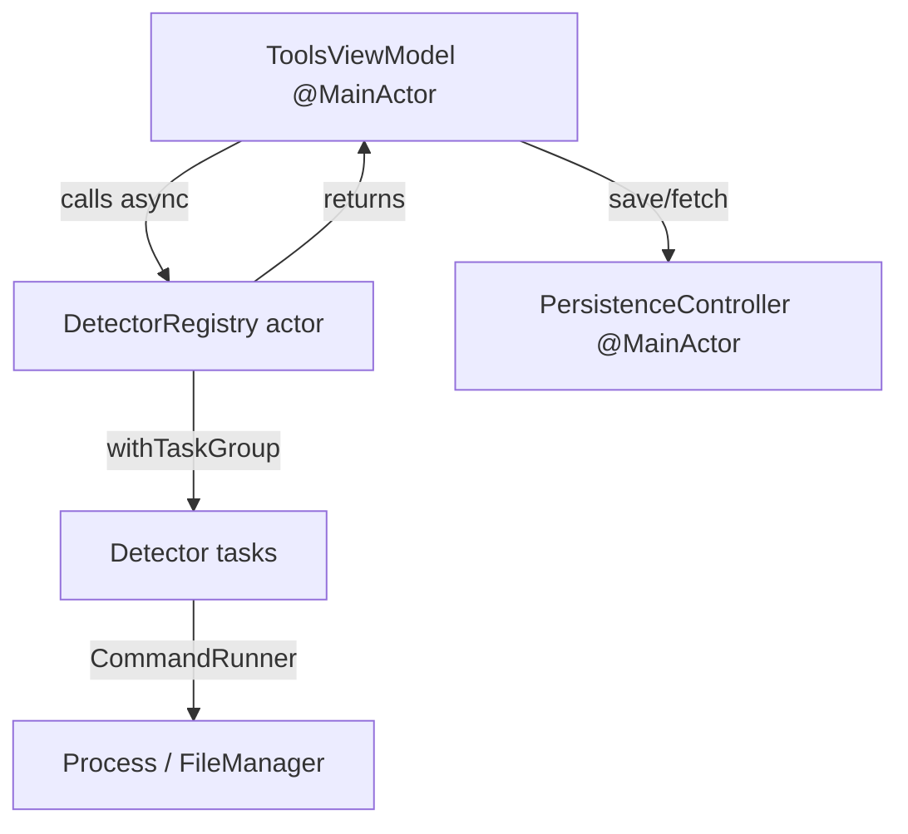
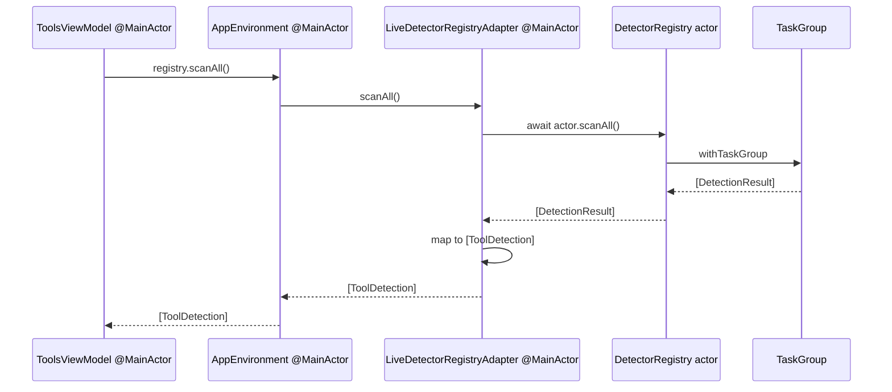
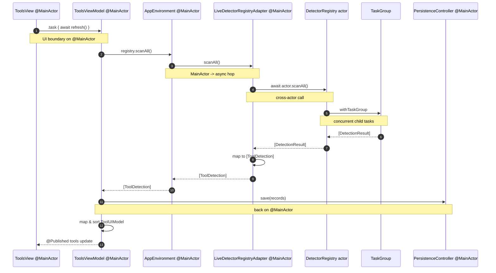

# Forge Concurrency

This document describes how Forge uses Swift concurrency to keep the UI responsive while running subprocess probes, file-system scans, and network calls. It covers actors, structured concurrency, `Sendable` strategy, and the boundary adapters that connect them. For the module layout, see [MODULES.md](MODULES.md); for detector internals, see [DETECTOR_ENGINE.md](DETECTOR_ENGINE.md).

## Concurrency philosophy

We follow three rules across Forge:

1. **Every long-running operation is `async`.** Detectors, cleanup dry-runs, and update lookups all suspend rather than blocking threads.
2. **Isolation is explicit.** We use `actor`, `@MainActor`, and `Sendable` to make data-race freedom checkable at compile time.
3. **No shared mutable state outside actors.** Value types cross boundaries; mutable reference types live inside actors or on the main actor.

We rejected an old-style dispatch-queue architecture because it scatters synchronization across the codebase and is hard to audit. We also rejected wrapping every protocol in an `NSLock` because actors give us the same safety with less boilerplate.



## Actor inventory

### DetectorRegistry

`DetectorRegistry` in `Packages/ForgeDetectors/Sources/ForgeDetectors/DetectorRegistry.swift:14` is an `actor`. It owns a mutable `[ToolID: any ToolDetector]` dictionary. Registration and scanning are both isolated to the actor, so callers must `await` them. The actor is reentrancy-safe: while a scan is in progress, another caller can still `register` a new detector.

### UpdateProviderRegistry

`UpdateProviderRegistry` in `Packages/ForgeUpdates/Sources/ForgeUpdates/UpdateProviderRegistry.swift:7` is also an `actor`. It fans out provider queries concurrently using `withTaskGroup`. Errors are captured per provider so one slow or broken source does not abort the others.

### PersistenceController

`PersistenceController` in `Packages/ForgeCore/Sources/ForgeCore/PersistenceController.swift:10` is `@MainActor`. It wraps `ModelContext` operations because SwiftData's main context is main-isolated. The `ModelContainer` it exposes is `Sendable`, so it can be passed into view modifiers safely.

### ToolsViewModel

`ToolsViewModel` in `Packages/ForgeUI/Sources/ForgeUI/ViewModels/ToolsViewModel.swift:7` is `@MainActor` and an `ObservableObject`. All `@Published` properties must be updated on the main actor, and because SwiftUI runs body evaluation on the main thread, this alignment is natural.

### AppEnvironment

`AppEnvironment` in `Packages/ForgeCore/Sources/ForgeCore/AppEnvironment.swift:67` is `@MainActor` and `Sendable`. It holds existential references to the registry protocols. Because it is main-isolated, it can be stored as a `StateObject` and observed by SwiftUI views.

## @MainActor boundary

The UI layer is fully `@MainActor`-isolated. `ToolsViewModel`, `AppEnvironment`, and `PersistenceController` all live on the main actor. Detector and update registries are not on the main actor; crossing into them requires `await`. When a view's `.task` calls `await toolsViewModel.refresh()`, the runtime suspends the task, runs the detector registry off the main actor, and resumes on the main actor to update published state.

We rejected isolating the detector registry on `@MainActor` because shelling out to `which` or `node --version` would block the UI. We rejected making `ToolsViewModel` non-isolated because SwiftUI observation requires main-thread updates.

## Structured concurrency

Both `DetectorRegistry.scanAll()` and `UpdateProviderRegistry.latestVersions(for:)` use `withTaskGroup` to fan out work. Every registered detector or provider becomes a child task. The parent waits for all children, collects results, and returns only after the group scope ends.

This structure gives us cancellation propagation for free: if the parent task is cancelled, the group's child tasks receive cancellation. Today we do not explicitly check `Task.isCancelled` inside detectors, but the group boundary is already in place.

## withTaskGroup pattern

`DetectorRegistry.scanAll()` in `Packages/ForgeDetectors/Sources/ForgeDetectors/DetectorRegistry.swift:33` uses `withTaskGroup(of: DetectionResult.self)`. It adds one task per detector, catches errors inside each child, and appends results to a local array. Because `TaskGroup` yields results in completion order, the method sorts by `toolId.rawValue` before returning.

`UpdateProviderRegistry.latestVersions(for:)` in `Packages/ForgeUpdates/Sources/ForgeUpdates/UpdateProviderRegistry.swift:28` uses `(String, Result<String, Error>)` tuples so the caller can map provider IDs back to results even though completion order is unstable.

## Cancellation

Cancellation is currently implicit through task lifetime. `ToolsView` refreshes are launched via `.task`, which is cancelled when the view disappears. The detector group itself does not yet check cancellation, but because the group is structured, cancellation propagates to child tasks. Future work will add explicit cancellation handlers inside long-running detectors.

We rejected exposing manual `Task` handles from the view model because `.task` already manages lifetime correctly for view-bound work.

## Sendable conformance strategy

Every type that crosses an actor boundary conforms to `Sendable`. This includes value types (`ToolDetection`, `SemVer`, `DryRunReport`) and the protocol existentials used in `AppEnvironment`. The DI slots are declared as `any ProtocolType`, which is `Sendable` when the protocol refines `Sendable`.

We deliberately avoid storing non-`Sendable` closures or classes in these protocols. `ToolDetector` and `CommandRunner` both refine `Sendable` so they can be passed into the actor's `TaskGroup`.

## The LiveDetectorRegistryAdapter

`LiveDetectorRegistryAdapter` in `Forge/Forge/DetectorRegistryAdapter.swift:10` is the bridge between the `DetectorRegistry` actor and the `DetectorRegistryProtocol` boundary used by `AppEnvironment` and `ToolsViewModel`.

```swift
@MainActor
final class LiveDetectorRegistryAdapter: DetectorRegistryProtocol {
    private let actor: DetectorRegistry

    func scanAll() async throws -> [ToolDetection] {
        let results = await actor.scanAll()
        return results.map { ... }
    }
}
```

It solves two problems. First, `DetectorRegistry` is an actor, but `AppEnvironment` stores a `Sendable` existential and is `@MainActor`; the adapter is `@MainActor` so it fits into SwiftUI's dependency graph. Second, the core protocol returns `ToolDetection`, while the detector registry returns richer `DetectionResult`; the adapter performs the mapping.

We rejected moving the mapping logic into `DetectorRegistry` because that would force the detectors package to depend on UI-shaped types. We rejected making `DetectorRegistry` itself conform to `DetectorRegistryProtocol` because the richer internal API and the core existential slot are intentionally separate.



## Thread-safety analysis

| Type | Isolation | Mutations allowed | Why it is safe |
|---|---|---|---|
| `DetectorRegistry` | `actor` | `detectors` dictionary | Actor serialization prevents concurrent read/write races. |
| `UpdateProviderRegistry` | `actor` | `providers` dictionary | Same actor guarantee as detector registry. |
| `PersistenceController` | `@MainActor` | `ModelContext` inserts/saves | Main-actor isolation matches SwiftData main context. |
| `ToolsViewModel` | `@MainActor` | `@Published` arrays | SwiftUI observes on main thread only. |
| `AppEnvironment` | `@MainActor` | existential slots reassigned at init | `Sendable` conformance plus main isolation. |
| `ToolRecord` / `DetectionRun` | `@Model`, main-context only | mutated by main context | SwiftData manages concurrency for model objects. |
| `ToolDetection` | value type, `Sendable` | immutable after creation | Value semantics + no shared references. |

## AsyncHelpers.parallelMap

`parallelMap` in `Packages/ForgeCore/Sources/ForgeCore/AsyncHelpers.swift:14` is a reusable fan-out helper:

```swift
public func parallelMap<T: Sendable, R: Sendable>(
    _ items: [T],
    _ transform: @escaping @Sendable (T) async throws -> R
) async throws -> [R] {
    try await withThrowingTaskGroup(of: (Int, R).self) { group in
        for (index, item) in items.enumerated() {
            group.addTask { (index, try await transform(item)) }
        }
        var results = [R?](repeating: nil, count: items.count)
        for try await (index, value) in group {
            results[index] = value
        }
        return results.map { $0! }
    }
}
```

The `(Int, R)` pairing preserves input order even though `TaskGroup` completion order is nondeterministic. We use a pre-sized optional array and force-unwrap at the end; this is safe because every index is written exactly once. If any transformation throws, the throwing task group cancels outstanding work.

We rejected returning a `Dictionary` keyed by index because arrays are the natural output for map operations and because consumers expect positional correspondence.

## Result+Extensions asyncMap

`Result+Extensions` in `Packages/ForgeCore/Sources/ForgeCore/Result+Extensions.swift:7` adds:

```swift
public extension Result {
    func asyncMap<NewSuccess>(
        _ transform: (Success) async throws -> NewSuccess
    ) async rethrows -> Result<NewSuccess, Failure>
}
```

This lets us chain async transformations on a `Result` without unwrapping. It is used infrequently today but is part of the concurrency toolkit so future detector pipelines can normalize results asynchronously.

## Sequence diagram: full refresh path with concurrency annotations



## Risk: Reentrancy in actor during scan

`DetectorRegistry.scanAll()` copies `detectors.values` into the `TaskGroup` and never reads the mutable `detectors` dictionary again during the scan. This avoids reentrancy hazards: if a caller registers a new detector while a scan is running, the new detector will not appear in the current scan but will be picked up in the next one.

We rejected locking the dictionary around the entire scan because that would serialize registration and scanning unnecessarily. We rejected reading `detectors` inside each `addTask` closure because the closure is not actor-isolated and would race with `register`.

## Risk: Long detector hangs TaskGroup forever

Today the `timeout` parameter on `scanAll` is declarative. A detector that calls `process.waitUntilExit()` on a hung process can block its child task indefinitely. The parent group will wait for all children.

Mitigation: replace `withTaskGroup` with `withThrowingTaskGroup`, add a `Task.sleep(timeout)` sibling task per detector child, and cancel the detector task when the timeout fires. We rejected wrapping `Process` in `DispatchQueue` because it would reintroduce queue-based concurrency and complicate cancellation.

## Risk: Swift 6 strict concurrency enablement

The project is built with Swift 6 but some packages still have legacy patterns (for example, `FakeCommandRunner` in tests uses `@unchecked Sendable`). As strict concurrency enforcement hardens, these sites may become errors.

Mitigation: enable Swift 6 strict concurrency package by package, starting with `ForgeCore`, then migrate `@unchecked Sendable` test helpers to properly isolated actors or value types. We rejected enabling strict mode globally in one PR because it would generate too many unrelated warnings and slow development.

## Future scalability

- Move detector timeout enforcement into `AsyncHelpers` so both detectors and update providers share the same watchdog logic.
- Introduce a custom global actor (e.g., `@DetectorActor`) if future background work needs isolation separate from the main actor but not a full actor type.
- Adopt `AsyncSequence` for long-lived update feeds once the update feature moves beyond one-shot polling.
- Audit every `@unchecked Sendable` site and remove them before declaring Swift 6 strict-concurrency compliance.

