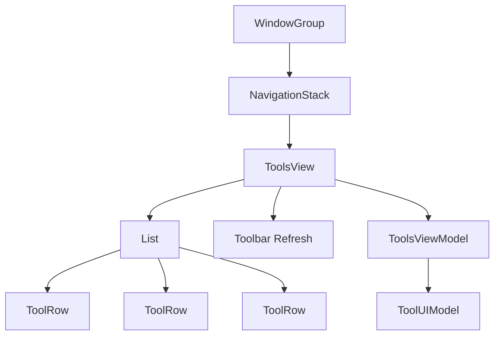
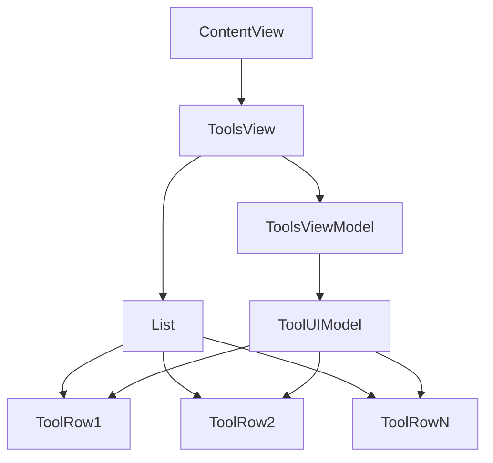
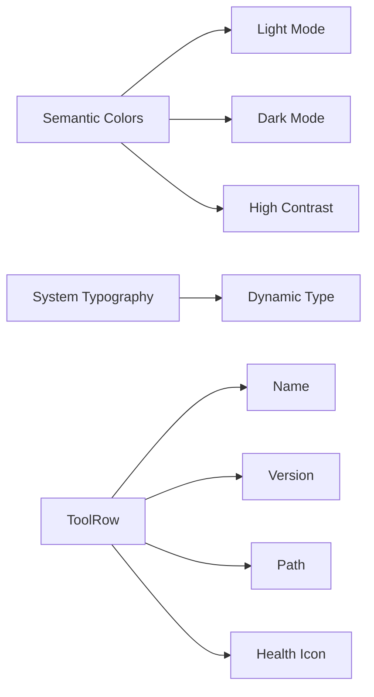

# Forge — Design System

> This document defines the visual and interaction design of Forge. It exists so that future UI work stays consistent with the current scaffold and with native macOS conventions.

## UI Philosophy

Forge is a native macOS utility, not a cross-platform dashboard. The interface uses system materials, semantic colors, and standard SwiftUI controls. We do not ship a custom theme in v1 because a native Mac app should look at home on macOS 14+ without extra visual chrome.

The design prioritizes clarity over density. The main Tools window is a single list with one row per tool. Each row communicates the tool name, version, install path, and health at a glance. Cleanup previews and update availability are secondary surfaces reached from the list.

We rejected a tabbed or sidebar-heavy layout because the first version has only one primary view. A `NavigationStack` gives us room to push detail sheets and cleanup previews without committing to a permanent navigation model.

## Navigation Pattern

The app uses a `NavigationStack` with a toolbar. The root view is `ToolsView`, which hosts the list of tools. The primary action is Refresh, placed in the toolbar via `ToolbarItem(.primaryAction)`.

```swift
NavigationStack {
    List(viewModel.tools) { tool in
        ToolRow(model: tool)
    }
    .navigationTitle("Tools")
    .toolbar {
        ToolbarItem(placement: .primaryAction) {
            Button { ... } label: { Label("Refresh", systemImage: "arrow.clockwise") }
        }
    }
}
```

We chose `NavigationStack` over `NavigationSplitView` because the app has no persistent sidebar or master-detail relationship. If future versions add categories or a settings pane, we can migrate to `NavigationSplitView` without changing the root view's identity.



## Component Hierarchy



`ContentView` at `Forge/ContentView.swift:1` is a thin wrapper that applies minimum size and hosts `ToolsView`. `ToolsView` at `Packages/ForgeUI/Sources/ForgeUI/Views/ToolsView.swift:1` owns the `NavigationStack`, the `List`, the toolbar, the refresh task, and the error alert. `ToolsViewModel` at `Packages/ForgeUI/Sources/ForgeUI/ViewModels/ToolsViewModel.swift:1` is the observable source of truth. `ToolRow` at `Packages/ForgeUI/Sources/ForgeUI/Components/ToolRow.swift:1` renders a single tool.

We rejected embedding the ViewModel inside the View as a `@StateObject` because constructor injection makes previews and tests simpler. `ToolsView` accepts an optional ViewModel and falls back to preview stubs when none is supplied.

## Component Anatomy

### `ToolRow`

Defined at `Packages/ForgeUI/Sources/ForgeUI/Components/ToolRow.swift:1`:

```swift
HStack(alignment: .center, spacing: 12) {
    VStack(alignment: .leading, spacing: 2) {
        Text(model.displayName)
            .font(.headline)

        Group {
            if let version = model.version {
                Text(version)
            } else {
                Text("not installed")
            }
        }
        .font(.subheadline)
        .foregroundStyle(.secondary)

        if let installPath = model.installPath {
            Text(installPath)
                .font(.caption)
                .foregroundStyle(.secondary)
                .lineLimit(1)
                .truncationMode(.tail)
        }
    }

    Spacer()

    Image(systemName: model.isHealthy ? "checkmark.circle.fill" : "exclamationmark.circle.fill")
        .foregroundStyle(model.isHealthy ? .green : .red)
        .accessibilityLabel(model.isHealthy ? "Healthy" : "Unhealthy")
}
.padding(.vertical, 4)
```

The row is an `HStack` containing a leading `VStack` for text and a trailing health icon. The display name uses `.headline`, the version or "not installed" label uses `.subheadline`, and the install path uses `.caption`. The install path is single-line and truncated to keep rows compact.

`ToolRow` has two initializers: one that accepts a full `ToolUIModel` and one that accepts only a name for placeholder use. We kept the name-only initializer for previews and early scaffolding, but production rows should always use the model initializer.

## Color & Typography

### Typography

| Element | Style | Rationale |
| ------- | ----- | --------- |
| Tool name | `.headline` | primary label in a list row |
| Version / status | `.subheadline` | secondary information |
| Install path | `.caption` | metadata, muted |
| Toolbar button | `.body` | default for controls |
| Alert title | `.headline` | system default |

We use system font styles exclusively. We rejected custom fonts because they increase binary size and can conflict with dynamic type.

### Color

| Element | Color | Rationale |
| ------- | ----- | --------- |
| Healthy icon | `.green` | positive status, semantic |
| Unhealthy icon | `.red` | negative status, semantic |
| Version / path | `.secondary` | de-emphasized metadata |
| Background | system material | native macOS appearance |
| Accent | system accent | respects user preference |

We chose semantic colors over a custom palette so the app adapts automatically to light mode, dark mode, and accessibility contrast settings. We rejected fixed hex colors because they break in dark mode and high-contrast modes.

## Dark Mode

Dark mode is automatic via SwiftUI semantic colors. There are no manual color overrides in v1. `.secondary`, `.green`, `.red`, and system materials all resolve correctly in both appearances.

We rejected a manual dark-mode palette because:

1. Semantic colors are already tested by Apple across modes and accessibility settings.
2. A custom palette would require ongoing maintenance as macOS evolves.
3. It adds no user value for a utility app in v1.

If future versions introduce a branded theme, the palette will be expressed as `Color` extensions that still resolve conditionally for light/dark/high-contrast.

## Accessibility

Accessibility is built into components, not bolted on.

- **VoiceOver**: the health icon in `ToolRow` has an explicit `accessibilityLabel`. We rejected relying on the default SF Symbol label because "checkmark.circle.fill" does not communicate health state meaningfully.
- **Dynamic Type**: all text uses system font styles, which respond to the user's preferred content size. We avoid fixed font sizes.
- **Reduce Motion**: the refresh spinner is implicit through `isLoading`; there is no custom animation. If animation is added later, it must respect `.accessibilityReduceMotion`.
- **Color blindness**: health status is encoded by both icon shape (checkmark vs. exclamation mark) and color, so it is not color-only.

We rejected adding a custom accessibility rotor because the list already supports standard VoiceOver navigation. A rotor may be added if the list grows beyond 20 items and needs category filtering.

## Interaction Patterns

### Refresh

- The Refresh button is disabled while `isLoading` is true.
- Tapping Refresh launches a `Task` that calls `toolsViewModel.refresh()`.
- The list updates automatically when `tools` is republished.

```swift
ToolbarItem(placement: .primaryAction) {
    Button {
        Task { await toolsViewModel.refresh() }
    } label: {
        Label("Refresh", systemImage: "arrow.clockwise")
    }
    .disabled(toolsViewModel.isLoading)
}
```

We chose a toolbar button over a pull-to-refresh because pull-to-refresh is not idiomatic on macOS. We rejected a manual refresh keyboard shortcut in v1; ⌘R will be added when the menu bar and menu extras ship.

### Error Alert

Errors are surfaced through a SwiftUI `.alert` bound to `ToolsViewModel.lastError`. The alert is dismissible and calls `dismissError()` when dismissed.

```swift
.alert(
    "Refresh failed",
    isPresented: Binding(...),
    presenting: toolsViewModel.lastError
) { _ in
    Button("OK") { toolsViewModel.dismissError() }
} message: { error in
    Text(error)
}
```

We chose a modal alert over inline error banners because scan failures are exceptional and should interrupt the user. As failures become more granular (per-tool errors), we may introduce row-level status badges.

### Sort

Tools are sorted by display name using `localizedStandardCompare`:

```swift
tools = detections
    .map(ToolUIModel.from(_:))
    .sorted { $0.displayName.localizedStandardCompare($1.displayName) == .orderedAscending }
```

We chose localized standard comparison over plain string comparison so version-like names and diacritics sort predictably. We rejected user-configurable sort in v1 to keep the interface simple.

## Loading States

Refresh loading state is communicated by disabling the toolbar button. `ToolsViewModel.isLoading` is set to `true` at the start of `refresh()` and reset via `defer { isLoading = false }`. There is no inline spinner in the list because scans are fast in the common case and the disabled button is sufficient feedback.

The empty state is not yet designed. When the list is empty, the view renders an empty `List`. Future versions should show a placeholder message such as "No tools detected" with a secondary Refresh button.

We rejected a full-screen loading overlay because it would block the entire window during a scan that may take several seconds. The disabled button + list update pattern keeps the window responsive.

## Previews

Every view has a `DEBUG`-only `#Preview` block. Previews use stub registries and stub persistence controllers so they do not require a real environment or filesystem access.

`ToolsView` defines a private `PreviewStubRegistry` and `PreviewStubPersistence` at `Packages/ForgeUI/Sources/ForgeUI/Views/ToolsView.swift:60`. These stubs conform to the core protocols and return empty collections. This pattern keeps preview code close to the view and avoids polluting the production API with preview-only types.

`ToolRow` has two previews: one using the name-only placeholder and one using a full model. We kept the placeholder preview because it is useful for layout iteration, but the canonical preview should use a realistic model.

We rejected a shared `PreviewSupport` package because the stubs are small and view-specific. If previews become complex across many views, we can extract a `ForgeUIPreviews` package that depends on `ForgeCore`.

## Future

### Liquid Glass

macOS 26+ may introduce the Liquid Glass design language. Forge should adopt Liquid Glass automatically where SwiftUI applies it through system materials and controls. We will not add custom glass effects in v1.

### Custom Theming

A future branded theme could include:

- A small set of accent colors chosen for the app icon.
- A custom color palette expressed as `Color` extensions with light/dark variants.
- Optional compact vs. comfortable list density.

We rejected custom theming in v1 because it competes with the native macOS aesthetic and adds maintenance overhead.

### Detail Sheets

When a user selects a tool row, a detail sheet could show:

- Full version breakdown.
- Health check list.
- Disk usage breakdown.
- Associated cleanup actions.

This will use `.sheet` or `NavigationLink` depending on whether the detail is modal or hierarchical.

## Future Scalability

- The current component hierarchy assumes a single-list UI. If future versions add categories, filters, or a sidebar, `ToolsView` should be refactored into a container view with child subviews, preserving `ToolRow` as the atomic row component.
- `ToolRow` currently embeds all metadata inline. If the number of metadata fields grows, consider a two-line or three-line layout, or move extended details into a disclosure group.
- Accessibility labels should be localized when the app supports multiple languages. The current labels are hard-coded English strings.
- The empty state, error state, and loading state should each have dedicated view components once the designs are finalized.

## Risks

1. **Placeholder previews leak into production**
   - *Likelihood*: Low. *Mitigation*: `#Preview` blocks are wrapped in `#if DEBUG` and compile out of release builds.
2. **Semantic colors behave unexpectedly in future macOS versions**
   - *Likelihood*: Low. *Mitigation*: we use only first-party semantic colors; any regressions are Apple's to fix or document.
3. **Custom theming added too early**
   - *Likelihood*: Medium. *Mitigation*: this document explicitly defers custom theming to a future phase; all v1 PRs must reference this decision.


