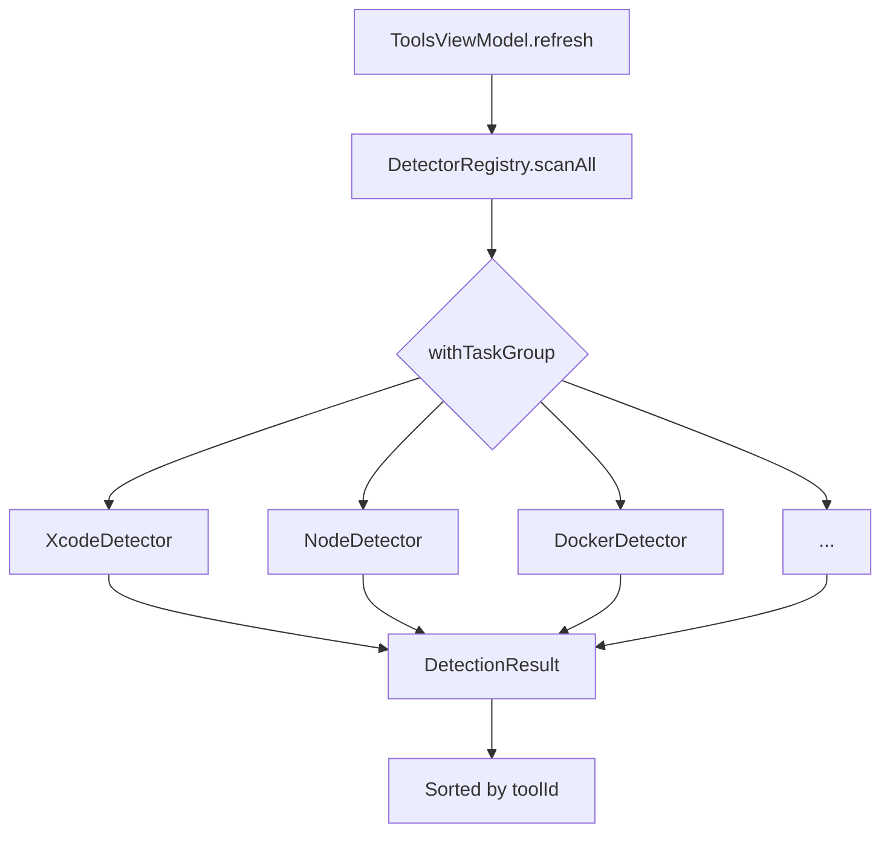
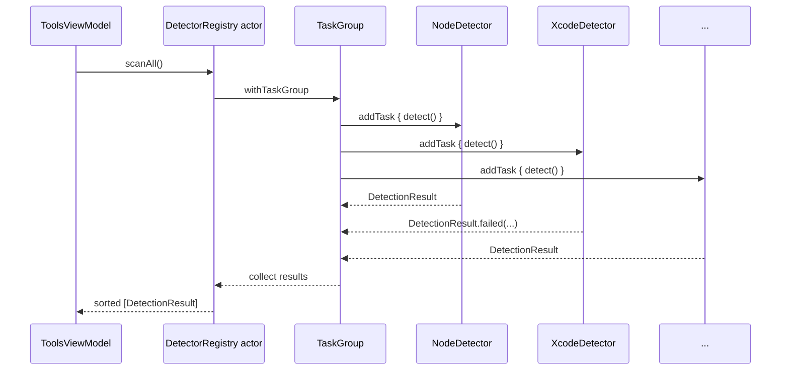
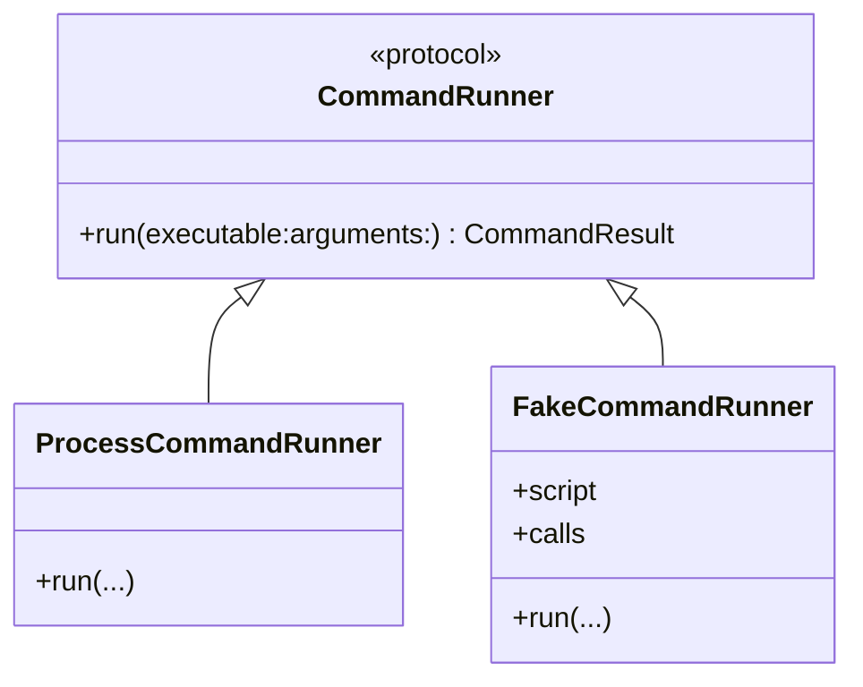
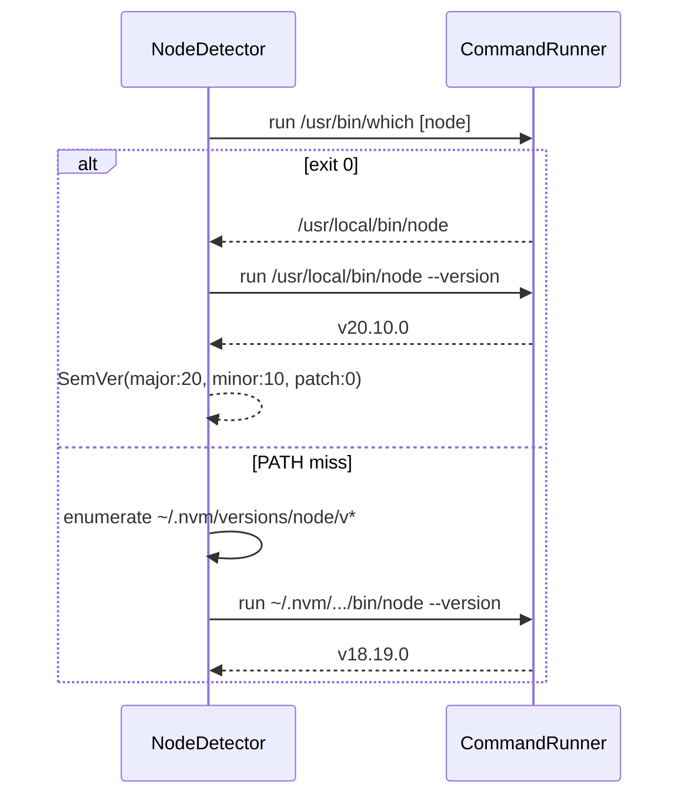
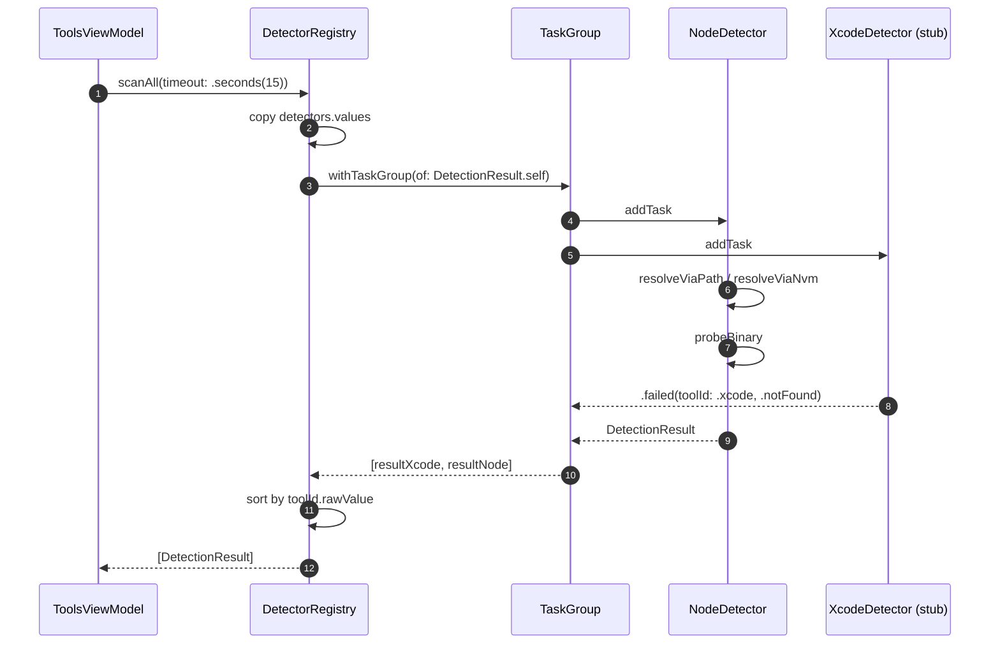

# Forge Detector Engine

This document describes how Forge discovers developer tools. It covers the detector protocol, the registry that runs detectors concurrently, error handling, and the concrete `NodeDetector` implementation. For the module layout that owns this code, see [MODULES.md](MODULES.md); for concurrency details, see [CONCURRENCY.md](CONCURRENCY.md).

## What a detector is

A detector answers three questions about a developer tool: is it installed, what version is it, and where does it live on disk? The challenge is doing this safely for arbitrary tools. Some tools are on `PATH`, some live inside version managers, some are macOS app bundles, and some require parsing package-manager output. A detector must never block the UI, never corrupt global state, and never let one broken probe break the entire scan.

We chose a protocol-per-tool design because each tool has a different source of truth. A single heuristic ("run `--version`") would miss Xcode, Docker Desktop, and Homebrew. We rejected a plugin-based architecture using dynamically loaded bundles because sandboxed macOS distribution makes dynamic loading fragile and because Swift packages already give us compile-time safety.



## The ToolDetector protocol

The canonical contract is in `Packages/ForgeDetectors/Sources/ForgeDetectors/ToolDetector.swift:5`:

```swift
public protocol ToolDetector: Sendable {
    var id: ToolID { get }
    var displayName: String { get }
    func detect() async throws -> DetectionResult
}
```

`Sendable` conformance is required because detectors cross actor boundaries inside `DetectorRegistry`. `id` is a closed `ToolID` so the registry can deduplicate detectors and the UI can map results to stable rows. `detect()` is `async throws` so detectors can shell out, read files, or perform network I/O without blocking a thread.

We rejected making `detect()` synchronous because most probes involve subprocesses; we rejected making it non-throwing because absence of a tool is a normal, expected failure that should be represented explicitly.

## Why an actor + TaskGroup for the registry

`DetectorRegistry` is an `actor` with a mutable dictionary of registered detectors. We use an actor rather than a class with locks because it gives compile-time isolation and reentrancy safety. The registry's `scanAll()` builds a `withTaskGroup` and adds one child task per detector. If one detector throws, only that child's result is converted to a failure; the rest of the group continues.

We rejected a plain `Task` per detector stored in an array because cancellation and result collection become manual and error-prone. We also rejected serial execution because a single slow tool would delay the whole scan.



## The dual API: scanAll() vs scanAllTyped()

`scanAll()` returns `[DetectionResult]` after flattening failures into the same shape as successes. This is the API the UI prefers because it can iterate uniformly. `scanAllTyped()` returns `[ToolID: Result<DetectionResult, DetectionError>]`, preserving the success/failure discriminator for callers that need to branch explicitly.

We keep both because `scanAll()` is convenient for the current SwiftUI list, while `scanAllTyped()` is better for future telemetry, batch reporting, or retry logic. We rejected returning `Result` everywhere because it would force every UI call site to unwrap.

## The DetectionResult model

`DetectionResult` lives in `Packages/ForgeDetectors/Sources/ForgeDetectors/DetectionResult.swift:5`:

```swift
public struct DetectionResult: Sendable, Equatable {
    public let toolId: ToolID
    public let version: SemVer?
    public let installPath: String?
    public let diskUsageBytes: Int64?
    public let configPath: String?
    public let runningStatus: RunningStatus?
    public let healthChecks: [HealthCheck]
    public let lastChecked: Date
}
```

All fields are optional except `toolId` and `lastChecked` because a detector can run and still produce partial information. `version` is a parsed `SemVer` rather than a raw string so comparisons are type-safe. `installPath` is a `String` rather than a `URL` because detectors often produce POSIX paths before validation. `runningStatus` captures whether a daemon or app is currently executing. `healthChecks` holds per-tool diagnostics; for example, `NodeDetector` records a `binary-source` check with detail `"PATH"` or `"nvm"`.

`RunningStatus` is an enum with `.running`, `.stopped`, and `.unknown`. We chose three states rather than a `Bool?` because some tools cannot be queried for execution status without an expensive operation.

`HealthCheck` is a small struct with `name`, `passed`, and `detail`. It lets the UI show why a tool is healthy or not without parsing error strings.

## The DetectionError enum

`DetectionError` in `Packages/ForgeDetectors/Sources/ForgeDetectors/DetectionError.swift:5` has five cases:

- `.notFound` — the binary or bundle is absent.
- `.timeout(seconds: Double)` — the probe took too long.
- `.permissionDenied(path: String)` — the detector cannot read a path.
- `.malformedOutput(detail: String)` — the tool responded, but the output could not be parsed.
- `.underlying(String)` — a catch-all for unexpected errors.

We intentionally kept the enum small. Callers can display human-readable text for each case, and the registry can map every non-`DetectionError` to `.underlying` safely. We rejected an open-ended `Error` payload because it would make `Equatable` conformance and UI mapping harder.

## The CommandRunner protocol

`CommandRunner` in `Packages/ForgeDetectors/Sources/ForgeDetectors/Tools/Node/NodeDetector.swift:6` abstracts subprocess execution:

```swift
public protocol CommandRunner: Sendable {
    func run(executable: URL, arguments: [String]) throws -> CommandResult
}
```

`CommandResult` bundles stdout, stderr, and exit code. `ProcessCommandRunner` is the production implementation using `Process`. Tests use `FakeCommandRunner` to script `which` and `node --version` responses without spawning real processes.

We rejected using `Process` directly inside detectors because it would make unit tests depend on the host environment. We also rejected a global shell runner because explicit `executable` URLs prevent shell-injection mistakes.



## Worked example: NodeDetector

`NodeDetector` in `Packages/ForgeDetectors/Sources/ForgeDetectors/Tools/Node/NodeDetector.swift:41` is the reference implementation. Its `detect()` method tries two resolution strategies in order:

1. `resolveViaPath()` runs `/usr/bin/which node`. If the exit code is `0` and stdout is non-empty, it returns the path.
2. `resolveViaNvm()` looks under `~/.nvm/versions/node/`, picks the highest version directory starting with `v`, and verifies the `bin/node` executable bit.

Once a path is found, `probeBinary(at:source:)` runs `<path> --version`, strips an optional leading `v`, and parses the remainder with `SemVer(parsing:)`. The `source` argument (`"PATH"` or `"nvm"`) is recorded in a `HealthCheck` detail so the UI can show where Node came from.

We ordered PATH before nvm because PATH is the system's current active version and is usually what the user considers canonical. We rejected merging both strategies into one probe because nvm directories can contain many installed versions and we want the active one first.



## The 11 stub detectors

The remaining detectors are placeholders under `Sources/ForgeDetectors/Tools/<Name>Detector/`. Each is expected to follow the `NodeDetector` pattern: locate the canonical install, probe for version, and report health.

| Tool | Expected source of truth | Edge cases |
|---|---|---|
| Xcode | `/Applications/Xcode.app/Contents/version.plist` or `xcodebuild -version` | Multiple Xcode versions, CLI tools only, beta paths |
| Android Studio | `/Applications/Android Studio.app` bundle plist | Preview/Canary naming, spaces in path |
| Docker | `docker --version` or `docker info` | Docker Desktop vs Colima, daemon not running |
| Homebrew | `brew --version` | Rosetta vs ARM brew, custom install prefix |
| Python | `python3 --version`, pyenv fallback | `python` vs `python3`, virtualenv pollution |
| Java | `java -version` (stderr!), `JAVA_HOME` | JVM vendors, version strings with build numbers |
| Flutter | `flutter --version` | Custom SDK paths, FVM versions |
| PostgreSQL | `postgres --version`, `pg_config --version` | Multiple clusters, Homebrew vs Postgres.app |
| Ollama | `ollama --version`, `~/.ollama` | Server running status |
| Git | `git --version` | Apple git vs Homebrew git, xcrun shim |
| VSCode | `/Applications/Visual Studio Code.app/Contents/Info.plist` | Insiders build, command-line `code` |

We intentionally left these as stubs so the registry and UI could be validated end-to-end before investing in per-tool archaeology.

## Error flattening strategy

`DetectionResult.failed(toolId:error:)` in `Packages/ForgeDetectors/Sources/ForgeDetectors/DetectionResult.swift:33` creates a result whose `healthChecks` array contains a single failed check with the error description. `DetectorRegistry` catches `DetectionError` directly and maps any other error to `.underlying`. This swallowing pattern is central to the engine: a single broken detector must not abort the whole scan.

We rejected bubbling per-detector errors out of `scanAll()` because the UI would have to handle partial failure on every refresh. We also rejected silently dropping failures because the user should see that a detector ran but could not complete.

## Timeout handling

`scanAll(timeout:)` declares a `Duration` parameter defaulting to 15 seconds, but the current implementation does not enforce it inside the group. The parameter documents the intended contract and lets future versions add enforcement without changing the call site.

We rejected removing the parameter until enforcement was ready because callers would hard-code assumptions about scan duration. The planned implementation is `withThrowingTaskGroup` plus a `Task.sleep` watchdog that cancels slow detectors.

## Parallel execution order

`TaskGroup` does not guarantee completion order. Two consecutive scans of the same 12 detectors can return results in different orders. `DetectorRegistry` therefore sorts the collected array by `toolId.rawValue` before returning it. UI-level sorting by display name happens in `ToolsViewModel`, but the registry guarantees a deterministic output.

We rejected relying on the UI to sort detector output because telemetry and tests also consume `scanAll()` and need stability.

## Sequence diagram: a full scan



## Future detector implementation strategy

When adding a new detector, follow this checklist:

1. **Pick the source of truth.** Prefer the active version the user actually invokes (PATH) over a version manager directory unless the tool is only ever installed through that manager.
2. **Design a fallback chain.** For example, Python should try `python3`, then `python`, then pyenv versions.
3. **Parse defensively.** Use `SemVer(parsing:)` when possible; for non-SemVer output (Java, Flutter), normalize the string before converting.
4. **Report health checks.** Add checks for "binary-source", "daemon-running", or "bundle-valid" so the UI has structured data.
5. **Test with `FakeCommandRunner`.** Script every subprocess call the detector makes and assert on the exact paths and arguments.
6. **Keep it side-effect-free.** Detectors must only read state, never write configuration or delete files.

We rejected a code-generator approach that would synthesize detectors from a JSON catalog because the edge cases per tool are too heterogeneous; hand-written detectors are more maintainable for a small catalog.

## Risks

| Risk | Likelihood | Mitigation |
|---|---|---|
| Detectors that spawn long-running processes hang the scan. | Medium | Enforce per-detector timeouts via `withThrowingTaskGroup` + `Task.sleep` cancellation. Until then, document the 15-second intended contract. |
| Detectors mutate global state. | Low | Keep the contract side-effect-free; review every new detector; add lint rules that forbid `FileManager` writes in `Sources/ForgeDetectors/Tools`. |
| Detectors require entitlements or user approval. | Medium | Defer these detectors to phase 2; gate them behind an opt-in settings flag and explicit user consent. |
| Version string formats vary widely and break `SemVer` parsing. | High | Add tool-specific normalization before parsing; fall back to raw string display when parsing fails. |
| A detector relies on shell environment variables that differ between Xcode launch and Terminal. | Medium | Document each detector's environment assumptions; prefer absolute paths over shell-dependent lookups. |

## Future scalability

- As the catalog grows, group detectors by ecosystem (mobile, web, data, AI) so domain experts can own each group.
- Add a `DetectorPlugin` registry loaded from static metadata so the app can enable/disable detectors without recompiling.
- Introduce per-detector caching with TTL to avoid re-probing tools whose versions rarely change.

