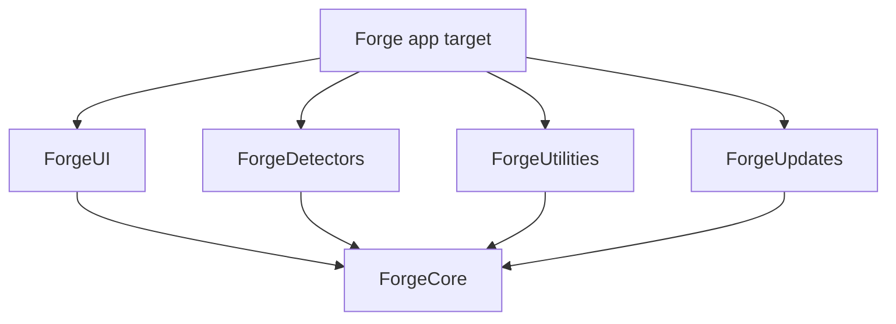

# Forge Module Guide

This document is the single source of truth for Forge's module layout. It explains why the code is split into five local Swift packages plus a thin app target, what each module owns, and where the extension points are. For concurrency and detector internals, see [CONCURRENCY.md](CONCURRENCY.md) and [DETECTOR_ENGINE.md](DETECTOR_ENGINE.md). For persistence specifics, see [PERSISTENCE.md](PERSISTENCE.md).

## Why we package the code this way

We chose five local Swift packages instead of one monolithic app target because the boundaries map directly to team ownership and release risk. `ForgeCore` is the only dependency of `ForgeUI`, which means UI work can move independently of detector experiments, cleanup actions, or update providers. Each package compiles under `swift test` in isolation, so a broken detector implementation cannot block the UI target from building. We rejected a single-package layout because it would have let implementation details leak across layers and made incremental testing slower on CI.

## ForgeCore

### Purpose
`ForgeCore` is the dependency-inversion kernel of the app. It defines the shared types, protocols, and no-op defaults that every other package depends on. Nothing in `ForgeCore` knows about `Process`, SwiftUI, network calls, or file-system cleanup; its job is to be the stable contract surface.

### Responsibilities
- Owns every `@Model` SwiftData type (`ToolRecord`, `DetectionRun`) so the schema is centralized.
- Defines the protocol boundary used by `ForgeUI`: `DetectorRegistryProtocol`, `PersistenceControllerProtocol`, `CleanupServiceRegistryProtocol`, `UpdateProviderRegistryProtocol`, `CleanupActionProtocol`, `TrashOnly`, and `UpdateProvider`.
- Owns the value types that cross actor and package boundaries: `ToolDetection`, `ToolID`, `SemVer`, `DryRunReport`.
- Provides the `AppEnvironment` dependency-injection container and no-op fallbacks so the app can launch before every concrete package is wired.
- Ships small concurrency utilities such as `AsyncHelpers.parallelMap` and `Result+Extensions`.

### Public API surface
- `public enum ToolID: String, Sendable, CaseIterable` — `Packages/ForgeCore/Sources/ForgeCore/Version.swift:7`
- `public struct SemVer: Equatable, Hashable, Sendable` with `init(major:minor:patch:)` and `init?(parsing:)` — `Packages/ForgeCore/Sources/ForgeCore/Version.swift:21`
- `public final class ToolRecord: { ... }` — `Packages/ForgeCore/Sources/ForgeCore/ToolRecord.swift:5`
- `public final class DetectionRun: { ... }` — `Packages/ForgeCore/Sources/ForgeCore/DetectionRun.swift:5`
- `public struct ToolDetection: Sendable, Equatable, Identifiable` — `Packages/ForgeCore/Sources/ForgeCore/AppEnvironment.swift:54`
- `public protocol DetectorRegistryProtocol: Sendable` with `scanAll() async throws -> [ToolDetection]` and `register(_:) async` — `Packages/ForgeCore/Sources/ForgeCore/AppEnvironment.swift:12`
- `public protocol PersistenceControllerProtocol: Sendable` with `@MainActor save(_:) throws`, `@MainActor fetchAll() throws -> [ToolRecord]`, and `container: ModelContainer` — `Packages/ForgeCore/Sources/ForgeCore/AppEnvironment.swift:22`
- `public protocol CleanupServiceRegistryProtocol: Sendable` with `availableActions() async -> [any CleanupActionProtocol]` — `Packages/ForgeCore/Sources/ForgeCore/AppEnvironment.swift:30`
- `public protocol UpdateProviderRegistryProtocol: Sendable` with `latestVersion(for:) async throws -> SemVer?` — `Packages/ForgeCore/Sources/ForgeCore/AppEnvironment.swift:35`
- `public protocol CleanupActionProtocol: Sendable` with `id`, `displayName`, and `dryRun() async throws -> DryRunReport` — `Packages/ForgeCore/Sources/ForgeCore/CleanupAction.swift:7`
- `public protocol TrashOnly: Sendable` — `Packages/ForgeCore/Sources/ForgeCore/CleanupAction.swift:20`
- `public struct DryRunReport: Sendable, Equatable` — `Packages/ForgeCore/Sources/ForgeCore/CleanupAction.swift:32`
- `public protocol UpdateProvider: Sendable` — `Packages/ForgeCore/Sources/ForgeCore/AppEnvironment.swift:41` (also declared in `ForgeUpdates`, but the canonical slot is here)
- `@MainActor public final class AppEnvironment: Sendable, ObservableObject` with `live(detectorRegistry:)` factory — `Packages/ForgeCore/Sources/ForgeCore/AppEnvironment.swift:67`
- `public func parallelMap<T: Sendable, R: Sendable>(_:@[Sendable](T) async throws -> R) async throws -> [R]` — `Packages/ForgeCore/Sources/ForgeCore/AsyncHelpers.swift:14`
- `public extension Result { func asyncMap<NewSuccess>(...) async rethrows -> Result<NewSuccess, Failure> }` — `Packages/ForgeCore/Sources/ForgeCore/Result+Extensions.swift:7`

### Internal implementation
`ToolRecord` and `DetectionRun` are `@Model` final classes because SwiftData requires reference semantics for model objects. The version is stored as three optional `Int` columns (`versionMajor`, `versionMinor`, `versionPatch`) rather than a single string so queries can range over major/minor/patch in the future. `AppEnvironment` is a `@MainActor` `ObservableObject` because SwiftUI state objects are expected to be main-isolated; it holds `any ProtocolType` existentials so the concrete packages can be swapped without recompiling the UI. No-op implementations are kept private to `AppEnvironment.swift` and are used only when `live()` cannot construct a real controller.

### Dependencies
- Imports: `Foundation`, `SwiftData`, `OSLog`.
- Depended on by: `ForgeDetectors`, `ForgeUI`, `ForgeUtilities`, `ForgeUpdates`, and the app target.

### Extension points
- Add new tool cases to `ToolID` when the catalog expands.
- Add new registry protocols here if future features need a new cross-package abstraction.
- Add new `@Model` types when we need to persist cleanup history or update-check metadata.

### Performance implications
- `AppEnvironment` is lightweight; it holds only existential references and publishes no heavy state.
- `parallelMap` uses `withThrowingTaskGroup` and keeps an optional result array sized to the input, so memory is `O(n)`.
- Because SwiftData model classes live here, any schema change forces a rebuild of every dependent package.

## ForgeDetectors

### Purpose
`ForgeDetectors` discovers which developer tools are installed, what version they report, and whether they appear healthy. It is the only package that spawns subprocesses and inspects the file system for detection purposes.

### Responsibilities
- Defines the richer `ToolDetector` protocol used internally.
- Implements `DetectorRegistry`, an actor that runs detectors concurrently and swallows per-detector failures.
- Defines `DetectionResult`, `DetectionError`, `RunningStatus`, and `HealthCheck`.
- Provides the injectable `CommandRunner` protocol plus a `ProcessCommandRunner` production implementation.
- Contains one real detector (`NodeDetector`) and eleven scaffold detectors.

### Public API surface
- `public protocol ToolDetector: Sendable` with `id: ToolID`, `displayName: String`, and `func detect() async throws -> DetectionResult` — `Packages/ForgeDetectors/Sources/ForgeDetectors/ToolDetector.swift:5`
- `public struct DetectionResult: Sendable, Equatable` with `toolId`, `version`, `installPath`, `diskUsageBytes`, `configPath`, `runningStatus`, `healthChecks`, `lastChecked` — `Packages/ForgeDetectors/Sources/ForgeDetectors/DetectionResult.swift:5`
- `public static func DetectionResult.failed(toolId:error:)` — `Packages/ForgeDetectors/Sources/ForgeDetectors/DetectionResult.swift:33`
- `public enum DetectionError: Error, Sendable, Equatable` with `.notFound`, `.timeout(seconds:)`, `.permissionDenied(path:)`, `.malformedOutput(detail:)`, `.underlying(String)` — `Packages/ForgeDetectors/Sources/ForgeDetectors/DetectionError.swift:5`
- `public enum RunningStatus: String, Sendable, Codable, Equatable` — `Packages/ForgeDetectors/Sources/ForgeDetectors/DetectionResult.swift:53`
- `public struct HealthCheck: Sendable, Equatable` — `Packages/ForgeDetectors/Sources/ForgeDetectors/DetectionResult.swift:61`
- `public protocol CommandRunner: Sendable` with `run(executable:arguments:) throws -> CommandResult` — `Packages/ForgeDetectors/Sources/ForgeDetectors/Tools/Node/NodeDetector.swift:6`
- `public struct CommandResult: Sendable` — `Packages/ForgeDetectors/Sources/ForgeDetectors/Tools/Node/NodeDetector.swift:13`
- `public struct ProcessCommandRunner: CommandRunner` — `Packages/ForgeDetectors/Sources/ForgeDetectors/Tools/Node/NodeDetector.swift:22`
- `public struct NodeDetector: ToolDetector` — `Packages/ForgeDetectors/Sources/ForgeDetectors/Tools/Node/NodeDetector.swift:41`
- `public actor DetectorRegistry` with `register(_:)`, `registeredIDs()`, `scanAll(timeout:)`, `scanAllTyped(timeout:)`, and `detect(_:)` — `Packages/ForgeDetectors/Sources/ForgeDetectors/DetectorRegistry.swift:14`

### Internal implementation
`DetectorRegistry` is an `actor` so registration and scanning can happen from any isolation domain without data races. It copies `detectors.values` into a `withTaskGroup` closure, catches each detector's errors, and converts them to either `.failed(...)` entries or `Result.failure`. Scan results are sorted by `toolId.rawValue` before return because `TaskGroup` gives no ordering guarantee. `NodeDetector` resolves Node via `/usr/bin/which node` and falls back to `~/.nvm/versions/node/v*`, then probes the binary with `--version` and parses the output through `SemVer(parsing:)`.

### Dependencies
- Imports: `Foundation`, `OSLog`, `ForgeCore`.
- Depends on `ForgeCore`.
- Depended on by: the app target and (for test/utilities convenience) `ForgeUI` via its package manifest.

### Extension points
- Add a new detector by creating `Sources/ForgeDetectors/Tools/<Name>Detector/<Name>Detector.swift` and conforming to `ToolDetector`.
- Register new detectors in `ForgeApp.swift` or in a future registry builder.
- Add new `DetectionError` cases only if the existing five cannot express a failure mode.

### Performance implications
- Each scan spawns one `TaskGroup` child per detector; CPU cost is bounded by the number of tools, not by nested loops.
- Subprocess calls (`which`, `node --version`) are the dominant latency, typically tens to hundreds of milliseconds each.
- `scanAll(timeout:)` accepts a `Duration` but currently applies it only to the group as a whole via the parameter's documentation contract; the actual timeout enforcement is a future enhancement.

## ForgeUI

### Purpose
`ForgeUI` owns the SwiftUI views and view models that render the tools list. It deliberately knows nothing about `Process`, detectors, or update network calls; it depends only on the protocols defined in `ForgeCore`.

### Responsibilities
- Defines `ToolUIModel` and `UpdateAvailabilityEntry` value types.
- Implements `ToolsViewModel`, a `@MainActor ObservableObject` that hydrates from persistence and refreshes from detectors.
- Implements `ToolsView` and `ToolRow`.
- Provides preview-friendly stubs so SwiftUI `#Preview` blocks work without a live registry or database.

### Public API surface
- `public struct ToolUIModel: Identifiable, Hashable, Sendable` with `from(_: ToolDetection)` and `from(_: ToolRecord)` factory methods — `Packages/ForgeUI/Sources/ForgeUI/Models/ToolRowModel.swift:5`
- `public struct UpdateAvailabilityEntry: Sendable, Equatable, Identifiable` — `Packages/ForgeUI/Sources/ForgeUI/Models/UpdateAvailabilityEntry.swift:7`
- `@MainActor public final class ToolsViewModel: ObservableObject` with `refresh()`, `loadCached()`, and `dismissError()` — `Packages/ForgeUI/Sources/ForgeUI/ViewModels/ToolsViewModel.swift:7`
- `public struct ToolsView: View` — `Packages/ForgeUI/Sources/ForgeUI/Views/ToolsView.swift:7`
- `public struct ToolRow: View` with `init(model:)` and `init(name:)` — `Packages/ForgeUI/Sources/ForgeUI/Components/ToolRow.swift:7`

### Internal implementation
`ToolsViewModel` holds existential references to `DetectorRegistryProtocol` and `PersistenceControllerProtocol`. `refresh()` sets `isLoading`, awaits `scanAll()`, maps results to `ToolRecord` for persistence, maps them to `ToolUIModel` for display, and sorts by `displayName` using `localizedStandardCompare`. `loadCached()` performs the same display mapping from `fetchAll()` without running detectors. `ToolsView` wraps a `NavigationStack` + `List`; `ToolRow` handles both full-model and name-only placeholder renderings.

### Dependencies
- Imports: `Foundation`, `SwiftUI`, `SwiftData`, `ForgeCore`.
- Package manifest also declares `ForgeDetectors` for test targets, but production source files import only `ForgeCore`.
- Depended on by: the app target.

### Extension points
- New tool metadata fields flow through `ToolUIModel` without touching views.
- Add cleanup UI by injecting a `CleanupServiceRegistryProtocol` into the view model.
- Add update badges by populating `UpdateAvailabilityEntry` from a future update registry call.

### Performance implications
- The view model publishes arrays of value-type models, so SwiftUI diffing is cheap.
- Sorting on the main actor is acceptable because the dataset is small (12 tools), but large catalogs should move sorting off the main actor.
- `defer { isLoading = false }` guarantees the loading spinner is cleared even if persistence throws.

## ForgeUtilities

### Purpose
`ForgeUtilities` is the home for safe cleanup actions. The first implementation targets Xcode DerivedData, but the package is designed to hold any future trash-only cleanup operation.

### Public API surface
- `public struct DerivedDataCleanupAction: CleanupActionProtocol, TrashOnly` with `init(rootURL:)` and `dryRun() async throws -> DryRunReport` — `Packages/ForgeUtilities/Sources/ForgeUtilities/DerivedDataCleanupAction.swift:7`

### Internal implementation
`DerivedDataCleanupAction` defaults to `~/Library/Developer/Xcode/DerivedData`, enumerates immediate subdirectories, and calls `recursiveSize(at:)` on each. `recursiveSize` uses `FileManager.enumerator` with `.skipsHiddenFiles`, skips symlinks, and accumulates `fileSize` values using `Int64 &+=` to avoid overflow. The action never deletes anything; it only reports candidate paths and a byte total.

### Dependencies
- Imports: `Foundation`, `ForgeCore`.
- Depends on `ForgeCore`.
- Depended on by: the app target.

### Extension points
- Add new cleanup actions under `Sources/ForgeUtilities/` and conform to `CleanupActionProtocol` plus `TrashOnly`.
- Wire a `CleanupServiceRegistry` in a future phase to vend available actions to the UI.

### Performance implications
- Enumerating DerivedData is `O(total files + directories)` and can take seconds when the directory contains gigabytes of build artifacts.
- The dry-run is currently serial; future actions can use `parallelMap` from `ForgeCore` if independent directories exist.
- Overflow-safe accumulation matters because DerivedData can exceed `Int64.max` only in theory, but using `&+=` removes that class of crash.

## ForgeUpdates

### Purpose
`ForgeUpdates` is the update-availability engine. Today it contains a registry and three stub providers; in the future it will query GitHub Releases, Homebrew formulae, and vendor plist feeds.

### Responsibilities
- Defines `UpdateProvider` and `UpdateProviderError`.
- Implements `UpdateProviderRegistry`, an actor that fans out provider queries concurrently.
- Ships three stubs: `GitHubReleasesProvider`, `HomebrewFormulaProvider`, and `VendorPlistProvider`.

### Public API surface
- `public protocol UpdateProvider: Sendable` with `id`, `displayName`, and `latestVersion(for:) async throws -> String` — `Packages/ForgeUpdates/Sources/ForgeUpdates/UpdateProvider.swift:7`
- `public enum UpdateProviderError: Error, Sendable, Equatable` with `.notImplemented` — `Packages/ForgeUpdates/Sources/ForgeUpdates/UpdateProviderError.swift:5`
- `public actor UpdateProviderRegistry` with `register(_:)`, `registeredIDs()`, and `latestVersions(for:)` — `Packages/ForgeUpdates/Sources/ForgeUpdates/UpdateProviderRegistry.swift:7`

### Internal implementation
`UpdateProviderRegistry` mirrors the detector registry pattern: it stores providers in a dictionary keyed by `id`, copies the values into a `withTaskGroup`, catches per-provider errors, and returns a `[String: Result<String, Error>]` map. This lets the UI show successes from one provider even if another provider fails.

### Dependencies
- Imports: `Foundation`, `ForgeCore`.
- Depends on `ForgeCore`.
- Depended on by: the app target.

### Extension points
- Replace stub provider bodies with real network or shell-out logic.
- Add new providers by conforming to `UpdateProvider` and registering them in the app target.
- Add a provider result aggregator that maps version strings back to `SemVer` for comparison.

### Performance implications
- Each provider runs in its own task, so network latency is parallelized rather than summed.
- Providers currently return `String`; future versions should parse into `SemVer` to avoid duplicate parsing in the UI layer.
- Unbounded provider registration could create too many concurrent network requests; a future phase should add a semaphore or provider priority queue.

## Forge app target

### Purpose
The app target is the thinnest possible shell. It assembles the concrete registries, wires them into `AppEnvironment`, and hosts the root SwiftUI view.

### Responsibilities
- Registers `NodeDetector` into a `DetectorRegistry` at launch.
- Bridges the actor-isolated registry to `DetectorRegistryProtocol` via `LiveDetectorRegistryAdapter`.
- Constructs `AppEnvironment.live()` and injects it into the SwiftUI scene.
- Applies the model container from `AppEnvironment.persistenceController.container` to the window group.

### Public API surface
- `@main struct ForgeApp: App` — `Forge/Forge/ForgeApp.swift:7`
- `struct ContentView: View` — `Forge/Forge/ContentView.swift:5`
- `@MainActor final class LiveDetectorRegistryAdapter: DetectorRegistryProtocol` — `Forge/Forge/DetectorRegistryAdapter.swift:10`

### Internal implementation
`ForgeApp.init` creates the actor on a background concurrency domain, registers `NodeDetector` inside a `@MainActor` `Task`, then wraps the actor in `LiveDetectorRegistryAdapter`. The adapter is `@MainActor` so it can be stored in the SwiftUI dependency graph and `AppEnvironment`. `ContentView` is a pass-through that sets a minimum window size and embeds `ToolsView`. `Assets.xcassets` and preview content live here.

### Dependencies
- Imports: `SwiftUI`, `ForgeCore`, `ForgeDetectors`, `ForgeUI`.
- Depends on all five packages.
- Nothing depends on the app target.

### Extension points
- Register additional detectors in `ForgeApp.swift`.
- Wire `ForgeUtilities` and `ForgeUpdates` into `AppEnvironment` when their UIs are ready.
- Add menu-bar or settings scenes here.

### Performance implications
- Launch cost is dominated by `PersistenceController` initialization, which opens a SQLite file at `~/Library/Application Support/Forge.store`.
- Detector registration is cheap, but scanning is triggered by `ToolsView.task`, not by app launch, so first paint is fast.

## Module-dependency matrix

| Package / Target | ForgeCore | ForgeDetectors | ForgeUI | ForgeUtilities | ForgeUpdates |
|---|---|---|---|---|---|
| ForgeCore | — | — | — | — | — |
| ForgeDetectors | ✓ | — | — | — | — |
| ForgeUI | ✓ | ✓ (manifest only) | — | — | — |
| ForgeUtilities | ✓ | — | — | — | — |
| ForgeUpdates | ✓ | — | — | — | — |
| Forge app target | ✓ | ✓ | ✓ | ✓ | ✓ |

## Future scalability

- When the catalog grows beyond 12 tools, consider splitting `ForgeDetectors` into per-ecosystem packages (e.g., `ForgeNodeDetectors`) so teams can ship detectors independently.
- `ForgeUI` may eventually need a dedicated `ForgeCleanupUI` package once cleanup UI becomes complex.
- `ForgeCore` should stay small. Resist the temptation to move concrete implementations into it; every new dependency in `ForgeCore` slows down the entire build graph.

## Risks

| Risk | Likelihood | Mitigation |
|---|---|---|
| `ForgeUI`'s package manifest declares `ForgeDetectors` as a dependency even though production code does not import it. | Medium | Audit the manifest and remove the dependency once test targets no longer need it, or split test-only dependencies into a separate target. |
| Schema changes in `ForgeCore` force rebuilds of every package. | High | Keep `ForgeCore` focused on stable protocols and value types; avoid churning `@Model` definitions. |
| The app target becomes a "junk drawer" for ad-hoc wiring. | Medium | Move registry construction into a dedicated `ForgeComposition` package when the wiring graph grows. |
| Local packages share the same git repository, so version boundaries are informal. | Low | Use semantic tags on the monorepo and pin package paths if packages are ever extracted to separate repositories. |

