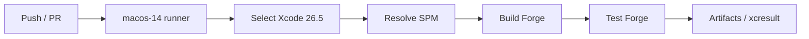

# Forge Operations Guide

> How Forge is built, tested, signed, released, and maintained. Companion to [ARCHITECTURE.md](./ARCHITECTURE.md), [TESTING.md](./TESTING.md), and [ADR.md](./ADR.md).

## CI/CD overview

Forge uses GitHub Actions. The runner is `macos-14`, and we explicitly pin the Xcode toolchain to `/Applications/Xcode_26.5.app`. The workflow builds the macOS app target and runs the full test suite on every push and pull request.



The workflow is intentionally simple: one job, no staging gates, no external secrets. This matches the current scaffold stage of the project.

## The CI workflow file

File: `.github/workflows/ci.yml`

### Triggers

```yaml
on:
  push:
    branches: ["**"]
  pull_request:
    branches: ["**"]
```

Every branch is built. We use concurrency control so pushes to the same branch cancel in-flight runs.

### Runner

```yaml
runs-on: macos-14
```

GitHub's `macos-14` image includes multiple Xcode versions. We do not trust the default selection.

### Xcode selection step

```yaml
- name: Select Xcode 26.5
  run: |
    if [ -d "/Applications/Xcode_26.5.app" ]; then
      sudo xcode-select -s "/Applications/Xcode_26.5.app/Contents/Developer"
    else
      echo "Xcode_26.5.app not found; using default Xcode ($(xcode-select -p))."
    fi
    xcodebuild -version
```

Pinning Xcode explicitly ensures that local and CI builds use the same compiler, SDK, and Swift runtime. This avoids "works on my machine" failures caused by default runner drift.

### Build and test steps

```yaml
- name: Build Forge
  run: |
    set -o pipefail
    xcodebuild \
      -project Forge.xcodeproj \
      -scheme Forge \
      -destination 'platform=macOS' \
      -configuration Debug \
      CODE_SIGNING_ALLOWED=NO \
      CODE_SIGNING_REQUIRED=NO \
      build

- name: Test Forge
  run: |
    set -o pipefail
    xcodebuild \
      -project Forge.xcodeproj \
      -scheme Forge \
      -destination 'platform=macOS' \
      -configuration Debug \
      CODE_SIGNING_ALLOWED=NO \
      CODE_SIGNING_REQUIRED=NO \
      test
```

We disable code signing in CI because signing identities are not available on the runner and are unnecessary for compilation and unit tests.

### Why no caching

The project is small. A full CI run currently completes in under three minutes, so the complexity of a SPM cache is not justified. If build times exceed 10 minutes, we will reconsider a centralized cache keyed by `Package.resolved`.

## Build process

The canonical local build command matches CI:

```bash
xcodebuild \
  -project Forge.xcodeproj \
  -scheme Forge \
  -destination 'platform=macOS' \
  -configuration Debug \
  CODE_SIGNING_ALLOWED=NO \
  CODE_SIGNING_REQUIRED=NO \
  build
```

For package-level development, use `swift build` inside the relevant `Packages/<Name>` directory. This is faster and does not require Xcode project resolution.

### Local build matrix

The following commands cover the local validation spectrum, from fast per-package iteration to the full umbrella test run:

```bash
# Full app build, ~30s cold, <5s incremental.
xcodebuild -scheme Forge -destination 'platform=macOS' build
```

Use this command when you have changed app-target code, added a new detector registration, or modified SwiftData models. It is the slowest local command but the one that most closely matches CI.

```bash
# Per-package fast loop, ~3s.
cd Packages/ForgeCore && swift test
```

Use this command for tight iteration on a single package. It compiles only that package and its tests and does not require the Xcode project. Replace `ForgeCore` with `ForgeDetectors`, `ForgeUI`, `ForgeUtilities`, or `ForgeUpdates` as needed.

```bash
# Full test suite via the umbrella target, ~10s.
xcodebuild test -scheme Forge -destination 'platform=macOS'
```

Use this command before committing. It runs the same matrix CI runs and catches cross-package issues that `swift test` alone cannot catch.

```bash
# Subset of the umbrella target, useful when only one package changed.
xcodebuild test -scheme Forge -destination 'platform=macOS' -only-testing:ForgeUtilitiesTests
```

Use this command to save time when you know exactly which umbrella test target is relevant. Replace `ForgeUtilitiesTests` with the target you want to isolate.

## Test execution strategy

- **Pull requests**: Run per-package `swift test` for the packages touched by the PR, plus the full `xcodebuild test` from CI.
- **Main branch**: Run the full `xcodebuild test` workflow on every merge.
- **Nightly (future)**: Run the full suite with Thread Sanitizer and code coverage enabled.

The umbrella `ForgeUtilitiesTests` target is the reason we use `xcodebuild test` rather than only `swift test`. See [TESTING.md](./TESTING.md) for the umbrella target pattern.

## Code signing posture

v1 is unsigned for local development. CI disables signing with:

```bash
CODE_SIGNING_ALLOWED=NO
CODE_SIGNING_REQUIRED=NO
```

The umbrella test target is also unsigned (`CODE_SIGNING_ALLOWED = NO`). This is acceptable for a scaffold distributed via source or ad-hoc download. Distribution requires a Developer ID certificate.

## Notarization strategy

Notarization is deferred to v2. v1 ships via direct download. Notarization requires:

- An active Apple Developer Program membership.
- A Developer ID Application certificate.
- `xcrun notarytool` (successor to `altool`).
- Hardened runtime entitlements.

When we enable notarization, the CI job will archive the app, submit the `.dmg` to Apple, and staple the ticket before publishing the release.

## Release management

The release process is currently lightweight and will become fully automated as the project matures. The concrete checklist for shipping a new version is:

1. **Tag the release on `main`.** Ensure `main` is green and contains the changelog for the version you are about to ship.

2. **Create a signed Git tag.** Use an annotated or signed tag so the release is attributable and verifiable:

   ```bash
   git tag --sign v0.1.0
   git push origin v0.1.0
   ```

3. **Build an unsigned DMG for sideload testing.** Validate that a clean build packages correctly and that the app launches on a machine that does not have the development environment.

4. **Build a signed and notarized DMG for distribution.** Archive the app with a Developer ID certificate, package it with `create-dmg`, submit the DMG to Apple via `notarytool`, and staple the resulting ticket. This step produces the artifact that is safe for end users to download.

5. **Upload to GitHub Releases.** Create a release from the signed tag, attach the notarized DMG, and generate release notes from the commit range:

   ```bash
   git log v0.0.1..v0.1.0 --pretty=format:'- %s'
   ```

Until notarization is enabled, users build from source or download a pre-built unsigned archive. The checklist above is documented now so that the transition to v2 distribution is mechanical rather than invented under pressure.

## The pbxproj + Package.swift workflow

The Xcode project file and SPM wiring are generated and regenerated by Ruby scripts that use the `xcodeproj` gem. We never edit `project.pbxproj` or `Package.swift` by hand when adding a new local package.

Why `xcodeproj` instead of `sed` or manual edits?

- **Idempotency**: The same script produces the same UUIDs and references on every run.
- **Safety**: The gem validates object graphs; manual edits can produce unopenable projects.
- **Reviewability**: A regenerated project diff is mechanical and easy to audit.

Repository scripts (e.g., `create_test_target.rb`) are the source of truth for project structure. If a script is missing or broken, fix the script and regenerate rather than patching the project file.

## Logging + telemetry

Forge uses `OSLog` with categories scoped by subsystem. The subsystem is `com.forge.app`, and the categories used are:

- `com.forge.app.app` — app lifecycle, environment assembly, and fatal errors.
- `com.forge.app.detector` — detector registry, individual detector starts and completions, and aggregate scan results.
- `com.forge.app.cleanup` — dry-run reports, Trash-only actions, and cleanup errors.
- `com.forge.app.persistence` — SwiftData model insertion, deletion, and migration events.
- `com.forge.app.update` — update-provider checks and version comparisons.
- `com.forge.app.ui` — view-model state changes and user-facing errors.

To view these logs in Console.app, search for:

```text
subsystem:com.forge.app
```

You can further narrow by category, for example:

```text
subsystem:com.forge.app category:detector
```

No remote telemetry is shipped in v1. All logs stay on the user's Mac. When logs include potentially sensitive data, they use the appropriate privacy annotation:

- `privacy: .public` is used for tool identifiers, store URLs, and other non-sensitive metadata that is useful for debugging.
- `privacy: .private` is used for user data such as file paths inside the home directory, detected version strings tied to the user's environment, and any output that could reveal the contents of the developer's machine.

The future telemetry feature will be opt-in, anonymous, and documented in a privacy policy before it is enabled.

## Crash reporting

Crash reporting is deferred to v2. v1 logs uncaught exceptions and errors to `OSLog`. A future integration may use a privacy-preserving crash reporter such as `Crashlytics` or a self-hosted symbolication pipeline, but only after explicit user opt-in.

## Backup + restore

The SwiftData store is written to:

```text
~/Library/Application Support/Forge.store
```

Users can back up or restore this file manually. Because the schema is additive-only in v1, copying a store from an earlier build forward is generally safe. Downgrades are not supported and may require deleting the store.

### Backup command

```bash
mkdir -p ~/backup
cp ~/Library/Application\ Support/Forge.store \
   ~/backup/Forge-$(date +%Y%m%d).store
```

Run this command before upgrading to a new version or before performing a bulk cleanup. The dated filename makes it easy to keep multiple restore points.

### Restore command

```bash
cp ~/backup/Forge-20260626.store \
   ~/Library/Application\ Support/Forge.store
killall Forge
```

Replace `20260626` with the date suffix of the backup you want to restore. The `killall Forge` step is required because SwiftData may keep the store file open while the app is running. After the app restarts, the restored state will be loaded.

## Future distribution channels

- **TestFlight beta**: After the first stable release, investigate TestFlight for Mac to distribute beta builds.
- **Mac App Store**: Requires sandboxing, notarization, and stricter entitlements. This is a v2 or later decision because it may limit filesystem access that detectors need.

## Risks

| Risk | Impact | Mitigation |
|---|---|---|
| Xcode version drift on CI runner | High | Explicit `xcode-select -s /Applications/Xcode_26.5.app`; CI fails if pinned Xcode is missing. |
| Local SPM drift from checked-in project | Medium | Regenerate `Forge.xcodeproj` with idempotent `xcodeproj` scripts; validate in CI with a fresh checkout. |
| Unsigned binary warnings on first launch | Medium | Document Right-click → Open flow; future notarization removes the warning. |
| Secrets exposure in CI logs | Low | No signing certificates or API keys are used in v1 CI. Future jobs will use GitHub secrets with restricted access. |
| Cache corruption if enabled later | Low | Do not enable SPM caching until we can key reliably on `Package.resolved` and clear caches on demand. |
| CI runner OS upgrade breaks Xcode pin | High | Pin to a specific GitHub Actions runner image via `runs-on: macos-14-xlarge` or use a self-hosted runner when budget allows; in the short term, document that CI may need re-pinning after each `macos-14` image refresh. |

## Future scalability

As Forge matures, operations will split into multiple workflows:

- **CI** (build + test on PR/push).
- **Nightly** (TSan, coverage, integration tests with real tools installed).
- **Release** (signed archive, notarized DMG, GitHub Release).
- **Dependency updates** (Renovate or Dependabot for SwiftPM packages).

We will adopt weekly CI cadence checks and automated release notes extracted from conventional commits. Until then, the single workflow in `.github/workflows/ci.yml` is the right level of operational overhead for a scaffold.

### CI cost projection

At the current pace, CI costs scale predictably with pull-request volume. A reasonable projection for an active project is:

- 5 PRs per day.
- 2 minutes of runner time per PR.
- $0.08 per minute for a macOS runner.

That yields approximately **$24 per day**, or roughly **$730 per month** for CI alone. As the test matrix grows — adding TSan runs, integration tests, and release builds — this number will increase.

The primary mitigation is path-based change detection. Use `dorny/paths-filter` in `.github/workflows/ci.yml` so that a change inside `Packages/ForgeUI` only triggers `ForgeUI` tests and a lightweight app build, while a change in `Packages/ForgeDetectors` triggers the detector package and its dependents. This avoids paying for a full umbrella run on every documentation or design-system change. When the project is small, the savings are modest; once pull-request volume crosses ten per day, path filtering becomes essential for keeping CI spend under control.

For build decisions, see [ADR.md](./ADR.md). For testing details, see [TESTING.md](./TESTING.md).
