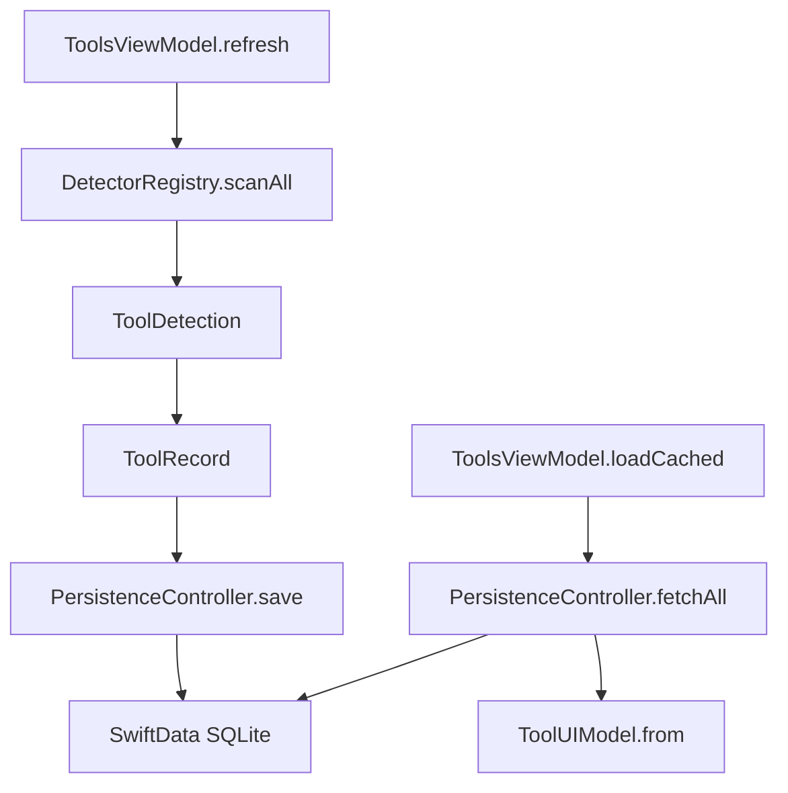
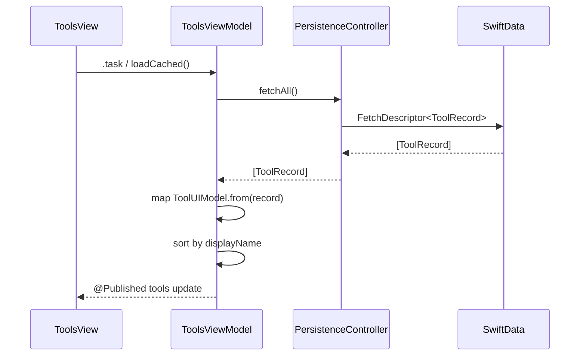

# Forge Persistence

This document explains how Forge persists detection results on macOS. It covers the SwiftData stack, the `@Model` schema, the persistence lifecycle, and the cold-start hydration path. For the module that owns these types, see [MODULES.md](MODULES.md); for concurrency rules, see [CONCURRENCY.md](CONCURRENCY.md).

## Why SwiftData

We chose SwiftData over Core Data, GRDB, and raw SQLite for three reasons. First, SwiftData is the first-party persistence framework for SwiftUI and macOS 14+, which minimizes boilerplate and integrates with `@Query`. Second, its concurrency model maps cleanly to Swift's actor system: `ModelContainer` is `Sendable`, while `ModelContext` is bound to an actor. Third, SwiftData's schema definition is compile-time checked through `@Model` macros, reducing a class of migration errors.

We rejected Core Data because it requires significantly more setup (`NSPersistentContainer`, `NSManagedObject` subclasses, manual concurrency rules) for a small schema. We rejected GRDB and raw SQLite because they would add an external dependency and force us to write migration SQL by hand; for a two-entity schema, that overhead is not justified. We may revisit GRDB if we later need complex aggregation queries or cross-platform support.



## The @Model types

### ToolRecord

`ToolRecord` in `Packages/ForgeCore/Sources/ForgeCore/ToolRecord.swift:5` is the persisted view of a detected tool:

```swift
@Model
public final class ToolRecord {
    @Attribute(.unique) public var id: UUID
    public var toolIdRaw: String
    public var displayName: String
    public var versionMajor: Int?
    public var versionMinor: Int?
    public var versionPatch: Int?
    public var installPath: String?
    public var diskUsageBytes: Int64?
    public var lastChecked: Date
    public var isHealthy: Bool
}
```

Field-by-field rationale:

- `id` — primary key; reused from the detection result so the same tool row is stable across refreshes.
- `toolIdRaw` — stores `ToolID.rawValue` because SwiftData cannot directly store a custom enum; it also makes queries inspectable in raw SQLite.
- `displayName` — cached human-readable name so the UI can render without loading the detector catalog.
- `versionMajor`, `versionMinor`, `versionPatch` — split into integer columns so future queries can filter by major version or detect outdated minors.
- `installPath` — stored as `String` because SwiftData has better support for strings than for `URL` in this schema.
- `diskUsageBytes` — `Int64` to accommodate large DerivedData or SDK directories.
- `lastChecked` — drives cold-start ordering and lets the UI show staleness.
- `isHealthy` — boolean snapshot of health at the time of the last scan.

### DetectionRun

`DetectionRun` in `Packages/ForgeCore/Sources/ForgeCore/DetectionRun.swift:5` records metadata about each scan operation:

```swift
@Model
public final class DetectionRun {
    @Attribute(.unique) public var id: UUID
    public var scanStartedAt: Date
    public var scanFinishedAt: Date?
    public var toolsFound: Int
    public var toolsFailed: Int
}
```

We keep `DetectionRun` separate from `ToolRecord` because scan-level metadata and per-tool records have different lifetimes. In the future, a retention policy can prune old `DetectionRun` rows without touching `ToolRecord` history.

## The store URL

`PersistenceController.storeURL` is a static computed property in `Packages/ForgeCore/Sources/ForgeCore/PersistenceController.swift:27`:

```swift
public static let storeURL: URL = {
    let fm = FileManager.default
    let support = try? fm.url(
        for: .applicationSupportDirectory,
        in: .userDomainMask,
        appropriateFor: nil,
        create: true
    )
    let base = support ?? fm.temporaryDirectory
    return base.appendingPathComponent("Forge.store")
}()
```

The file lives at `~/Library/Application Support/Forge.store`. We chose `applicationSupportDirectory` because it is the standard macOS location for app-specific data, it is excluded from Time Machine by convention, and it does not require entitlements. The fallback to `temporaryDirectory` prevents a launch crash if the sandbox or permissions ever block creating the support directory.

We rejected storing the file in `Documents` or `Caches` because `Application Support` is the correct domain for a small structured database.

## The persistence lifecycle

`PersistenceController` in `Packages/ForgeCore/Sources/ForgeCore/PersistenceController.swift:10` is the concrete implementation of `PersistenceControllerProtocol`. It is `@MainActor`-isolated because `ModelContext` operations must happen on the context's actor.

```swift
@MainActor
public final class PersistenceController: PersistenceControllerProtocol {
    public let container: ModelContainer
    public var mainContext: ModelContext { container.mainContext }

    public init(inMemory: Bool = false) throws { ... }

    public func save(_ records: [ToolRecord]) throws {
        for record in records {
            mainContext.insert(record)
        }
        try mainContext.save()
    }

    public func fetchAll() throws -> [ToolRecord] {
        let descriptor = FetchDescriptor<ToolRecord>(
            sortBy: [SortDescriptor(\.lastChecked, order: .reverse)]
        )
        return try mainContext.fetch(descriptor)
    }
}
```

The lifecycle is: initialize the container, insert records on refresh, save, and fetch on cold start. `save` performs a plain insert for every record; SwiftData handles upsert semantics for `@Attribute(.unique)` keys. We chose this over an explicit fetch-and-merge because the dataset is tiny and the UUIDs are stable.

## The PersistenceControllerProtocol

The protocol in `Packages/ForgeCore/Sources/ForgeCore/AppEnvironment.swift:22` is:

```swift
public protocol PersistenceControllerProtocol: Sendable {
    var container: ModelContainer { get }
    @MainActor func save(_ records: [ToolRecord]) throws
    @MainActor func fetchAll() throws -> [ToolRecord]
}
```

We expose `container` so SwiftUI can inject it via `.modelContainer(environment.persistenceController.container)`. We marked `save` and `fetchAll` as `@MainActor` because the default main context is main-isolated, and callers must already be on the main actor to use it. We made the protocol `Sendable` because `AppEnvironment` crosses concurrency boundaries.

We rejected hiding `ModelContainer` behind opaque methods because SwiftUI's `.modelContainer(_:)` modifier needs the concrete container. We rejected making the protocol `@MainActor` globally because that would limit future background-context implementations.

## The NoOpPersistenceController

`NoOpPersistenceController` in `Packages/ForgeCore/Sources/ForgeCore/AppEnvironment.swift:93` is an in-memory fallback used for previews, tests, and when the real controller fails to initialize. It constructs a `ModelConfiguration(isStoredInMemoryOnly: true)` and ignores save/fetch calls. This lets the app launch and the UI render even if the SQLite file is locked or corrupt.

We rejected crashing on persistence initialization failure because a developer-tool manager should degrade gracefully.

## Cold-start hydration path

When `ToolsView` appears, its `.task` calls `ToolsViewModel.refresh()`, which runs detectors and saves. If the user later relaunches the app, `ToolsViewModel.loadCached()` reads from persistence instead of re-scanning.

The path is:

1. `ToolsViewModel.loadCached()` calls `persistence.fetchAll()`.
2. `fetchAll()` returns `ToolRecord` rows sorted by `lastChecked` descending.
3. `ToolUIModel.from(_: ToolRecord)` reconstructs a version string from major/minor/patch and maps the record into a UI model.
4. The view model sorts the resulting array by `displayName` using `localizedStandardCompare`.

We rejected re-scanning on every launch because subprocess probes are too slow for a fast first paint. We rejected storing fully rendered UI models because that would couple the database schema to presentation details.



## Write path

`ToolsViewModel.refresh()` in `Packages/ForgeUI/Sources/ForgeUI/ViewModels/ToolsViewModel.swift:18` performs the write:

1. Set `isLoading = true` and clear `lastError`.
2. Call `registry.scanAll()` to get `[ToolDetection]`.
3. Map each `ToolDetection` to a `ToolRecord` via `ToolUIModel.record(from:)`, splitting the version string into major/minor/patch.
4. Call `persistence.save(records)`.
5. Map detections to `ToolUIModel` for display and sort.
6. `defer { isLoading = false }` clears the spinner.

The version split in `ToolUIModel.parseVersion` is intentionally lenient: missing or unparseable components become `nil`. We chose leniency because not every tool reports a clean SemVer, and we would rather show a partial version than fail persistence.

## Why version is split into Int columns

Storing `versionMajor`, `versionMinor`, and `versionPatch` as optional integers rather than a single string gives us three advantages. First, we can query "all tools with major version < 20" directly in SwiftData. Second, future auto-update logic can compare persisted local versions against upstream versions numerically. Third, it prevents drift between parsing and display: the detector parses once, persistence stores structured data, and the UI reconstructs the string.

We rejected a single `versionString` column because it would force re-parsing at query time and make range queries impossible.

## Schema migrations

The current migration strategy is additive-only. New fields are added as optional properties with default values, and SwiftData performs lightweight migration automatically. We have not yet introduced `VersionedSchema` or custom migration plans because the schema is small and every change so far has been additive.

We rejected writing custom migration code for v1 because there are no production users to migrate. We will adopt `VersionedSchema` before any destructive or required-field change.

## Caching strategy

Forge uses a two-tier cache:

1. **Cold-start hydrate** — read `ToolRecord` rows from SwiftData.
2. **Refresh re-run** — detectors are re-executed on demand, not on a timer.

This keeps the persistence layer simple: there is no cache invalidation logic, no TTL, and no background refresh. We rejected a polling refresh because it would waste battery and generate unnecessary subprocess traffic.

## Concurrency notes

`ModelContainer` is `Sendable`, so it can cross actor boundaries safely. `ModelContext` is not `Sendable`; `PersistenceController` isolates it on `@MainActor`. `ToolsViewModel` is also `@MainActor`, so calls to persistence do not require a hop. The detector registry, in contrast, is an actor on its own isolation domain; results arrive asynchronously before being saved.

We rejected performing saves on a background actor because SwiftData's main-context saves are cheap for small batches and because SwiftUI expects model updates on the main actor.

## Privacy and data minimization

`ToolRecord` stores only tool metadata: name, version, install path, disk usage, and last-checked timestamp. It does not store environment variables, shell history, project paths, or any personally identifiable information. `DetectionRun` stores only aggregate counts. We chose this narrow schema to reduce the impact of a compromised store file and to keep backups small.

We rejected storing full command output or detector logs in SwiftData because that would increase storage and privacy risk without improving functionality.

## Risks

| Risk | Likelihood | Mitigation |
|---|---|---|
| Migration breaks existing users. | Low | Use additive-only changes until v2; adopt `VersionedSchema` before any destructive change. |
| Store file grows unbounded. | Medium | `DetectionRun` has no retention policy yet. Add a prune job in v2 that keeps only the last N runs. |
| Concurrent writes corrupt the store. | Low | All writes go through `@MainActor save`; future background contexts will use explicit context isolation. |
| `ToolRecord` upserts duplicate rows. | Low | `id` is marked `@Attribute(.unique)`; verify that detector results reuse stable UUIDs. |
| In-memory fallback hides a real persistence failure. | Low | Log fallback usage via `Logger.persistence` and surface a subtle UI indicator in v2. |

## Future scalability

- Encrypted store: protect the SQLite file with a Keychain-derived key before storing any sensitive paths.
- iCloud sync: deferred to v2 because tool install paths are machine-specific and syncing them across Macs is low value.
- Background refresh: add a `Task` in `ForgeApp` that refreshes detectors every hour while the app is open, but only when on AC power.
- Retention policy: prune `DetectionRun` and old `ToolRecord` snapshots to cap disk usage.

