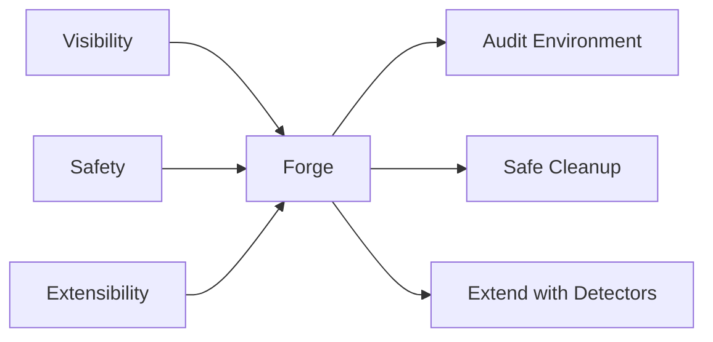

# Forge — Project Vision

> Forge exists to make the developer environment on macOS visible, safe, and extensible. This document defines why we are building it, what we believe, and where we are going.

## Why Forge Exists

Developer environments on macOS are fragmented. A single workstation can accumulate dozens of runtimes, package managers, editors, SDKs, and containers across `/Applications`, `/opt/homebrew`, `/usr/local`, `~/.nvm`, `~/.pyenv`, and many other locations. Teams lose time answering basic questions:

- Who has the correct Xcode version installed?
- Where is Node coming from — Homebrew, nvm, or the system?
- Why does this machine have 40 GB of DerivedData?
- Which tools are out of date and exposing us to CVEs?

Existing tools solve pieces of this problem, but none give a single, native, privacy-first view of the whole environment. Forge is that view. It does not install tools, sync settings, or run in the cloud. It observes, reports, and cleans safely.

## Product Philosophy: The Three Pillars

### 1. Visibility

You cannot manage what you cannot see. Forge's first job is to answer, in one window: *what is installed, where is it, what version is it, and is it healthy?* Every tool gets a row with version, install path, disk usage, and a health indicator. Scans run in parallel and persist locally, so the app is useful even when offline.

### 2. Safety

Cleanup is the most dangerous feature we will ship. The default safety posture is *dry-run first, Trash-only commit*. No destructive `rm -rf`, no permanent deletion, no privileged escalation. We chose this because the cost of accidentally deleting a user's project cache is far higher than the cost of asking them to empty Trash.

### 3. Extensibility

New tools appear constantly. Forge is designed so that adding support for a new tool means adding a single detector type and registering it. The UI, persistence, and scan orchestration do not change. This is enforced by protocols (`ToolDetector`, `CleanupActionProtocol`, `UpdateProvider`) and a registry pattern, not by branching logic in view-models.

## Design Principles

1. **Local-first, device-bound data**
   All scan results, cleanup reports, and settings live in the local SwiftData store at `~/Library/Application Support/Forge.store`. We rejected cloud persistence because developer environment data is sensitive and rarely needs to be synchronized across devices.

2. **No telemetry by default**
   Forge uses OSLog for diagnostics and never phones home. We rejected analytics SDKs because they violate the local-first principle and increase supply-chain risk.

3. **Protocol-driven extensibility**
   Every subsystem is exposed as a protocol in `ForgeCore` (`DetectorRegistryProtocol`, `CleanupServiceRegistryProtocol`, etc.). We rejected a monolithic `Services` singleton because protocols let us test layers in isolation and swap implementations without touching UI code.

4. **Trash-only as default**
   Cleanup actions conform to `TrashOnly` and use `FileManager.trashItem(at:resultingItemURL:)`. We rejected an `execute()` method on `CleanupActionProtocol` in the scaffold because committing deletions before the safety culture is proven would be reckless.

5. **Concurrency-native**
   Detector scans run concurrently via `withTaskGroup`. ViewModels are `@MainActor`. Persistence writes are serialized on the main actor. We rejected Combine pipelines for orchestration because Swift Concurrency gives us structured cancellation, actor isolation, and clearer error paths.

6. **Native macOS over cross-platform**
   We use SwiftUI, SwiftData, and AppKit integrations directly. We rejected Electron or cross-platform frameworks because they add memory footprint, degrade accessibility, and slow integration with macOS services like Spotlight and the menu bar.

7. **Additive evolution**
   SwiftData models and registry APIs are designed to grow without breaking existing installs. We rejected aggressive normalization because lightweight, additive schemas minimize migration risk.

## User Personas

### Indie Developer

Alex is a solo iOS contractor with a two-year-old MacBook Pro. They have Xcode, Homebrew, nvm, Docker, and half a dozen Python virtualenvs. Alex wants to reclaim disk space and verify that the right Node version is active before a client demo. Forge gives them a single window instead of a dozen terminal commands.

### Team Lead

Priya manages a platform team of 12 engineers. Onboarding a new hire means checking that Xcode, Homebrew, Docker, and the company VPN are installed and compatible. Priya uses Forge to compare environments and document the canonical setup, without running a shell script on every machine.

### DevOps / SRE

Jordan runs CI runners and local Kubernetes clusters. They need to know whether Docker Desktop is running, which simulator runtimes are installed, and how much cache is stale. Forge surfaces running status and cache size, and its dry-run cleanup lets Jordan reclaim space safely before a release week.

### Student Learning

Morgan is learning full-stack development and has installed tools by following many tutorials. They are not sure which versions are active or why `node` points to a different path than their classmate's machine. Forge shows the install path and version clearly, building intuition without requiring terminal fluency.

## Competitive Landscape

| Capability | Homebrew Bundle | asdf | mise | Devpod | Devbox | Forge |
| ---------- | --------------- | ---- | ---- | ------ | ------ | -------- |
| Multi-language runtimes | Partial | Strong | Strong | Strong | Strong | Strong (via detectors) |
| Native macOS GUI | No | No | No | No | No | Yes |
| Safety-first cleanup | No | No | No | No | No | Yes (Trash-only) |
| Plugin / detector marketplace | No | Limited | Limited | No | No | Planned |
| Health diagnostics | No | No | No | No | No | Yes |
| Local-only / no cloud | Yes | Yes | Yes | N/A | N/A | Yes |
| Install tools | Yes | Yes | Yes | Yes | Yes | No (by design) |

### Why we are different

- **Homebrew Bundle** is great for reproducible installs but has no GUI, no health checks, and no cleanup visualization.
- **asdf** and **mise** are version managers, not system observers. They manage per-project runtimes but do not tell you what is installed globally or how much space it uses.
- **Devpod** and **Devbox** create reproducible dev environments, often inside containers. They are environment *creators*, not environment *auditors*.
- **Forge** is an auditor and safe janitor. It does not install; it discovers, reports, and cleans.

## Future Vision

### One Year

- All 12 detector scaffolds are implemented with version, path, disk usage, and health.
- Cleanup suite covers Xcode DerivedData, Docker dangling artifacts, Homebrew cache, npm/pip caches, Gradle, CocoaPods, Ollama models, and VS Code extension cache.
- Update providers check GitHub Releases, Homebrew formulae, and vendor plists.
- A menu bar extra gives one-glance status and a refresh shortcut.

### Three Years

- Spotlight importer lets users type a tool name in ⌘Space and jump to its Forge detail view.
- Plugin marketplace or public detector registry allows third-party detectors without forking the app.
- Recommendation engine suggests cleanups based on staleness, size thresholds, and project activity.
- Keyboard shortcuts and a compact overlay mode for power users.

### Five Years

- AI-assisted install guidance: Forge detects a missing tool and shows a vetted install command or link, but still does not execute it automatically.
- Tighter IDE integrations: JetBrains, VS Code, and Xcode extensions that surface Forge health directly in the editor.
- Enterprise features: team baseline comparison, policy checks, and signed detector manifests — all still local-first.

## Non-Goals

To keep the product focused, Forge explicitly will **not**:

- **Act as a package manager.** We do not install, uninstall, or upgrade tools. We report and recommend; the user or their existing package manager performs the action.
- **Sync settings or scan history across devices.** Data stays on the Mac.
- **Run on non-macOS platforms.** SwiftUI, SwiftData, and macOS-specific integrations are core to the experience.
- **Collect telemetry or analytics.** OSLog is the only observability channel.
- **Execute arbitrary user-supplied shell commands.** Inputs to detectors are hard-coded; there is no script runner.
- **Delete files permanently.** All cleanup is Trash-only.
- **Escalate privileges.** Forge reads what the user can already read and moves files to their own Trash.

## Future Scalability

- As the detector count grows beyond 12, the user personas may split into "auditors" (who care about health and compliance) and "reclaimers" (who care about cleanup). The UI should support filtering and saved views.
- The competitive table will need a separate "enterprise" column if team baselines and policy checks are added.
- The non-goals list should be reviewed annually; the *no install* decision is the most likely to be debated as users ask for one-click updates.

## Risks

1. **Scope creep toward package management**
   - *Likelihood*: Medium. *Mitigation*: the non-goals list is explicit and every major feature proposal must be checked against it. The `CleanupActionProtocol` intentionally lacks an `execute()` method.
2. **Competitors add GUI before us**
   - *Likelihood*: Medium. *Mitigation*: our moat is native macOS integration (Spotlight, menu bar, SwiftData) and the Trash-only safety contract, not just a UI wrapper around CLI tools.
3. **Privacy expectations mismatch**
   - *Likelihood*: Low. *Mitigation*: telemetry is a non-goal, documented in this file and in `ARCHITECTURE.md`, and enforced by the absence of network calls except explicit update checks.

