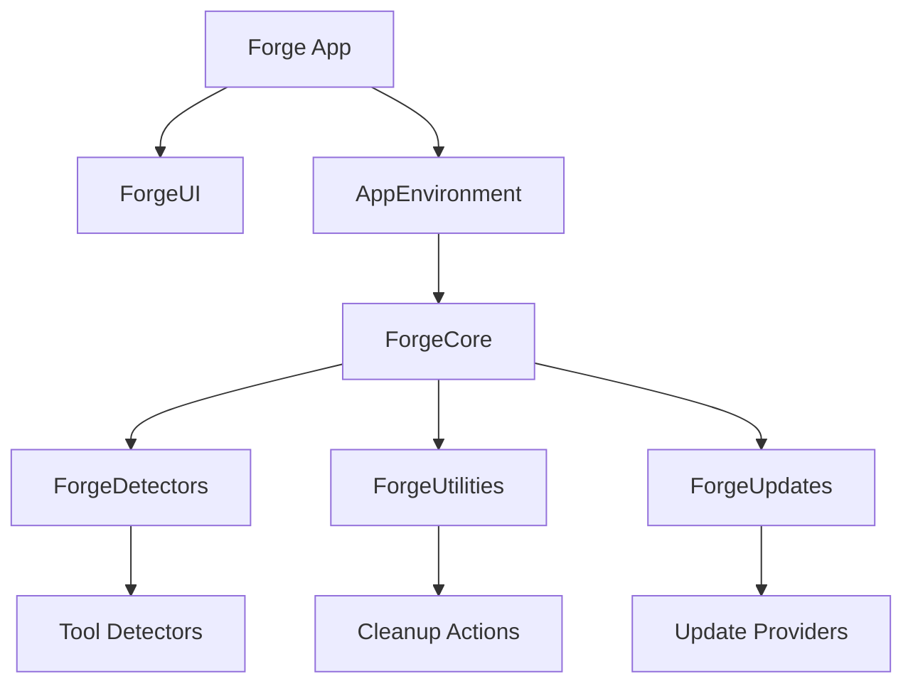
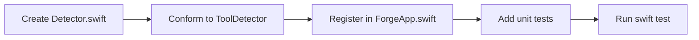

# Forge

> A native macOS app that auto-discovers the developer tools on your Mac, shows their version, install path, and health, and performs safe, Trash-only cleanup.

Forge is a Swift 6, SwiftUI, and SwiftData application for macOS 14+. It scans the system for common developer tools, persists the results locally, and ships with a dry-run cleanup pipeline that only ever moves files to Trash. The architecture is protocol-driven, concurrency-native, and split into small local Swift packages so detectors, UI, cleanup, and update-checking can evolve independently.

## Why Forge

- **Visibility first**: see every installed tool, where it lives, and whether it is healthy in one window.
- **Safety by default**: cleanup is dry-run first and Trash-only; no file is permanently deleted.
- **Native macOS**: SwiftUI, SwiftData, and Swift Concurrency — no Electron, no cross-platform abstraction tax.
- **Extensible by design**: add a new detector by conforming to `ToolDetector`, registering it at launch, and adding a test.
- **No telemetry**: all data stays on device; logs use OSLog with privacy annotations.

## Features

- **Protocol-based detector registry with concurrent `TaskGroup` scanning.** The registry treats every detector as an independent actor, which means a slow probe — such as waiting for a Docker daemon to respond — never blocks the Node detector or any other fast path. This keeps the main UI responsive and makes the scan time roughly equal to the slowest individual detector rather than the sum of all detectors.

- **Node.js detector with PATH resolution and `~/.nvm` fallback.** It locates the active `node` binary through the user's shell PATH and, when PATH does not resolve to a managed version, falls back to common nvm directories. This matters because many Mac developers install Node through nvm, and naive `which node` checks often return stale or shim-only results.

- **11 additional detector scaffolds ready for implementation.** Docker, Homebrew, Git, Xcode Command Line Tools, Ruby, Python, Rust, Go, Java, PostgreSQL, and Redis all have placeholder detectors. The scaffolding means the next contributor can focus on the detection heuristic rather than on wiring a new package, view, or persistence model.

- **SwiftData persistence at `~/Library/Application Support/Forge.store`.** Detection results survive app restarts, so reopening Forge is instant even when the full scan takes seconds. The store path is deterministic, which makes backup, restore, and debugging straightforward.

- **MVVM SwiftUI interface with `NavigationStack`, toolbar refresh, and error alerts.** The view layer is decoupled from the detector layer through view-models, making it possible to unit-test presentation logic without spinning up real tools. Toolbar actions and error surfacing follow the patterns used in Apple's own system settings apps.

- **Xcode DerivedData dry-run cleanup with Trash-only semantics.** Before any bytes are moved, the app presents a dry-run report listing size, paths, and affected targets. The actual action only ever calls `NSWorkspace.recycle(_:)`, so a mistaken cleanup is recoverable from Trash.

- **Update-provider interfaces (GitHub Releases, Homebrew formula, vendor plist) stubbed for future phases.** Forge is designed to notify users when a tool has a newer version, but the update engine is intentionally factored behind a protocol so we can support upstream release pages, formula metadata, and vendor plists without rewriting the UI.

- **GitHub Actions CI on `macos-14` with Xcode 26.5.** Every push and pull request is built and tested against a pinned toolchain, which catches compiler drift between local machines and CI before it reaches `main`.

## Screenshots

> Screenshots are placeholders while the UI stabilizes. Replace the files below before distribution.


*The main Tools window lists detected tools with version, path, and health status.*


*A dry-run preview shows what would be moved to Trash before any change is made.*

## Architecture Summary

Forge is organized into five local Swift packages. `ForgeCore` owns the shared types, protocols, and `AppEnvironment` dependency container. `ForgeDetectors` owns the `ToolDetector` protocol and the `DetectorRegistry` actor that runs every detector in parallel. `ForgeUI` contains the SwiftUI views and view-models and depends only on `ForgeCore` through protocol boundaries. `ForgeUtilities` hosts cleanup actions, and `ForgeUpdates` hosts update-provider interfaces.

The full rationale, diagrams, risks, and extension guide are in [`ARCHITECTURE.md`](ARCHITECTURE.md).



## Installation

1. Clone the repository:

   ```bash
   git clone <repo-url> Forge
   cd Forge
   ```

2. Open `Forge.xcodeproj` in Xcode 26.5 or later.

3. Select the `Forge` scheme and run (⌘R), or build from the command line:

   ```bash
   xcodebuild -project Forge.xcodeproj -scheme Forge -destination 'platform=macOS' build
   ```

## Build Instructions

Build the full app:

```bash
xcodebuild -project Forge.xcodeproj -scheme Forge -destination 'platform=macOS' build
```

Run the test suite:

```bash
xcodebuild test -project Forge.xcodeproj -scheme Forge -destination 'platform=macOS'
```

You can also test individual Swift packages from their directories:

```bash
cd Packages/ForgeCore && swift test
cd Packages/ForgeDetectors && swift test
cd Packages/ForgeUI && swift test
cd Packages/ForgeUtilities && swift test
```

Expected outcomes:

- `xcodebuild build` exits 0.
- `xcodebuild test` runs 21+ SPM tests plus the `DerivedDataCleanupActionTests` target.
- The app launches and lists Node.js if it is installed.

## Development Workflow

- **Language**: Swift 6, with strict concurrency enabled where possible.
- **Packages**: local SwiftPM packages under `Packages/`. Each package has its own `Package.swift` and test target.
- **UI pattern**: MVVM. ViewModels are `@MainActor ObservableObject` types; Views are pure functions of published state.
- **Dependency injection**: `AppEnvironment.live()` creates the live graph with NoOp defaults, so the app builds before every subsystem is wired.
- **Persistence**: SwiftData. Models live in `ForgeCore` and are injected via `.modelContainer(_:)`.
- **Testing**: use XCTest for package tests; integration tests that depend on installed tools must guard assertions with `XCTSkipUnless`.
- **Cleanup safety**: every cleanup action must conform to `CleanupActionProtocol` and produce a `DryRunReport`. Trash-only actions also conform to `TrashOnly`. No `execute()` method exists in the scaffold.

### Daily loop

The typical Forge development cycle is designed to be fast and low-ceremony. Start by editing code in Xcode on the package or target you are currently touching, then iterate through progressively larger scopes of validation:

1. **Edit in Xcode.** Work inside `Packages/<Name>` for package code or inside `Forge/` for app-target code. The project is generated, so if you add or remove files you must run the project regeneration script to keep `Forge.xcodeproj` in sync.

2. **Run `swift test` for the package you changed.** This is the fastest feedback loop — typically around three seconds — because it skips Xcode project resolution and only compiles the affected package and its tests.

3. **Run `xcodebuild build` on the app target.** Once the package tests pass, confirm that the full app still links and compiles. This catches issues that only appear at the app-target boundary, such as missing package imports or SwiftData model container mismatches.

4. **Run `xcodebuild test` for the umbrella target.** The umbrella target in the Xcode project runs tests that span multiple packages, including the `DerivedDataCleanupActionTests` target. Run this before committing.

5. **Commit and push.** Write a concise commit message that describes the detector, fix, or view you changed. Push to a feature branch and open a pull request. CI will run the same full matrix on `macos-14`, giving the reviewer a green check before any human review starts.

## Folder Structure

```text
Forge/
├── Forge.xcodeproj              # Xcode project for the macOS app target
├── Forge/                       # App target sources
│   ├── ForgeApp.swift           # App entry point, environment assembly
│   ├── ContentView.swift           # Root view wrapper
│   ├── DetectorRegistryAdapter.swift # Actor-to-protocol bridge
│   └── Assets.xcassets/            # App icons and accent color
├── Packages/                       # Local SwiftPM packages
│   ├── ForgeCore/               # Shared types, protocols, persistence, DI
│   │   ├── Sources/ForgeCore/
│   │   └── Tests/ForgeCoreTests/
│   ├── ForgeDetectors/          # Detector protocol, registry, and 12 tool scaffolds
│   │   ├── Sources/ForgeDetectors/
│   │   └── Tests/ForgeDetectorsTests/
│   ├── ForgeUI/                 # SwiftUI views, view-models, and components
│   │   ├── Sources/ForgeUI/
│   │   └── Tests/ForgeUITests/
│   ├── ForgeUtilities/          # Cleanup actions and Trash-only contracts
│   │   ├── Sources/ForgeUtilities/
│   │   └── Tests/ForgeUtilitiesTests/
│   └── ForgeUpdates/            # Update-provider protocol and stubs
│       ├── Sources/ForgeUpdates/
│       └── Tests/ForgeUpdatesTests/
├── .github/workflows/ci.yml        # GitHub Actions CI
├── ARCHITECTURE.md                 # Deep architecture guide
├── PROJECT_VISION.md               # Product vision and competitive landscape
├── DESIGN_SYSTEM.md                # UI/UX design system
├── ROADMAP.md                      # Ordered implementation phases
└── README.md                       # This file
```

## Adding a New Tool Detector

Detectors live in `Packages/ForgeDetectors/Sources/ForgeDetectors/Tools/<Name>Detector/`. The canonical recipe is:

```swift
// 1. Create Sources/ForgeDetectors/Tools/RedisDetector/RedisDetector.swift
import ForgeCore

public struct RedisDetector: ToolDetector {
    public let id = ToolID.redis

    public init() {}

    public func detect() async -> DetectionResult {
        // Run `redis-server --version`, parse the version string,
        // and return .found, .notFound, or .error.
    }
}

// 2. Implement ToolDetector with id: ToolID.<name>
//    (shown above: id = ToolID.redis)

// 3. In Forge/ForgeApp.swift register the detector at init:
//    await registry.register(RedisDetector())

// 4. Write Tests/ForgeDetectorsTests/RedisDetectorTests.swift
import XCTest
@testable import ForgeDetectors

final class RedisDetectorTests: XCTestCase {
    func testID() {
        XCTAssertEqual(RedisDetector().id, ToolID.redis)
    }

    func testDetectDoesNotCrash() async {
        let detector = RedisDetector()
        _ = await detector.detect()
    }
}

// 5. Update ARCHITECTURE.md's tool list to include Redis.
```

The full contract, a longer code example, and the test-stub pattern are documented in [`ARCHITECTURE.md § Detector API Contract & Extension Guide`](ARCHITECTURE.md#detector-api-contract--extension-guide) and [`DETECTOR_ENGINE.md`](DETECTOR_ENGINE.md).



## Continuous Integration

Forge uses GitHub Actions. The workflow is defined in `.github/workflows/ci.yml`. It runs on every push and pull request, selects Xcode 26.5, builds the app, and runs the test suite. See [`OPERATIONS.md`](OPERATIONS.md) for runner details, troubleshooting, and release procedures.

## Future Roadmap

The current repo is a buildable scaffold. Upcoming phases implement the remaining 11 detectors, the full cleanup suite, update providers, a menu bar extra, Spotlight integration, and keyboard shortcuts. The ordered plan is in [`ROADMAP.md`](ROADMAP.md).

## Future Scalability

Forge is intentionally small today, but the architecture is designed to support the following growth areas without rewrites:

- **Tool coverage.** The detector registry is protocol-based, so adding support for new languages, databases, containers, and cloud CLIs only requires a new `ToolDetector` implementation and a matching test. The goal is to reach parity with the tools most engineering teams install during onboarding.

- **Menu bar mode.** A lightweight menu bar extra will surface the health summary and a one-click refresh without opening the full app. This targets the common workflow of quickly checking whether a dependency is healthy before running a build.

- **Spotlight plugin.** A Core Spotlight importer will make installed tools searchable from macOS Spotlight, so users can type "node" or "docker" and jump directly to version, path, and health information.

- **AI suggestions.** On-device or opt-in language-model suggestions will recommend cleanup actions based on detected tool versions, duplicate installs, and stale caches. Any cloud-based suggestion feature will be strictly opt-in and documented in a privacy policy.

- **Plugin marketplace.** A future plugin system will allow third-party detectors to be distributed as signed Swift packages or `.forge` bundles. The marketplace will reuse the existing `ToolDetector` protocol and sandbox file access to keep the security model simple.

## Contributing

Contributions are welcome. Please keep the following standards in mind so the codebase stays consistent as it grows:

- **Swift 6 strict concurrency.** Prefer `Sendable`, actors, and structured concurrency. Avoid unchecked `Sendable` conformances unless justified in a code comment.
- **No force-unwraps except in test `setUp`.** Production code should use optional binding, `guard`, or explicit error propagation. Tests may force-unwrap setup values that are guaranteed by the test fixture.
- **Every detector gets a test.** At minimum, assert the detector's `id`, assert that `detect()` does not crash, and assert behavior for both the installed and not-installed cases where practical.
- **Every public type is `Sendable`.** If a public struct or class crosses concurrency boundaries, make its `Sendable` conformance explicit and validated by the compiler.
- **Every SwiftUI view has a `#Preview` in `DEBUG`.** Previews keep views testable in isolation and help future contributors understand the view's required state.

Before opening a pull request, run the full test suite locally and verify that `xcodebuild build` exits cleanly.

## License

Forge is released under the MIT License. See `LICENSE` for details.

## Risks

1. **Docs drift**: as the scaffold evolves, README instructions can become stale.
   - *Likelihood*: Medium. *Mitigation*: each ROADMAP phase includes a verification one-liner; README build commands are copied from CI.
2. **Screenshot placeholders ship**: placeholder images could be mistaken for final UI.
   - *Likelihood*: Low. *Mitigation*: the screenshot section is explicitly labeled placeholder and gated behind a `Docs/Screenshots/` directory that is not bundled in the app.
3. **Package count confusion**: older versions of the docs referenced seven packages; the current code has five.
   - *Likelihood*: Low. *Mitigation*: this README was regenerated from the actual `Packages/` directory and links to `ARCHITECTURE.md` for the canonical module graph.
