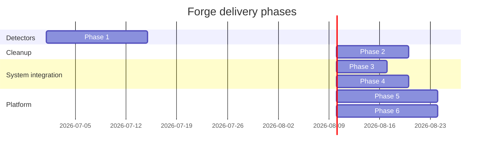

# Forge Roadmap

> Where Forge is today and where it is going. This doc is the source of truth for sequencing. Architectural rationale lives in [ARCHITECTURE.md](./ARCHITECTURE.md); decisions are recorded in [ADR.md](./ADR.md); operations and CI details are in [OPERATIONS.md](./OPERATIONS.md).

## Current state

Forge is a buildable macOS scaffold, not a finished product. It already contains:

- Five local Swift packages: `ForgeCore`, `ForgeDetectors`, `ForgeUI`, `ForgeUtilities`, `ForgeUpdates`.
- Twelve tool detector slots; only `NodeDetector` is implemented. The other 11 are stubs.
- SwiftData persistence via `ToolRecord` and `DetectionRun` (`Packages/ForgeCore/Sources/ForgeCore/ToolRecord.swift:7`).
- A dry-run cleanup pipeline with one action: `DerivedDataCleanupAction` (`Packages/ForgeUtilities/Sources/ForgeUtilities/DerivedDataCleanupAction.swift:6`).
- 21 passing tests across SPM + one umbrella Xcode target.
- GitHub Actions CI on `macos-14` pinning Xcode 26.5.

The goal of the current phase is to prove the architecture: detectors run concurrently, results persist, cleanup is safe, and CI is green. Everything after this is expansion.

## Guiding principles

1. **Extension by protocol.** New tools, cleanup actions, and update sources plug into existing protocols. We do not special-case behavior.
2. **Safety by default.** Cleanup is dry-run first and trash-only always. No destructive removal APIs are permitted in cleanup code.
3. **No vendor lock-in.** We parse standard command-line output and read public filesystem paths. We do not depend on proprietary SDKs for detection.



## Phase 1: Tool detectors

**Scope**: Implement the 11 remaining detector stubs.

**Complexity**: L

| Tool | Source of truth | Parse strategy |
|---|---|---|
| Xcode | `/usr/bin/xcodebuild -version` | First line `Xcode X.Y` |
| Android Studio | `~/Library/Application Support/Google/AndroidStudio*/*/AboutVersion.properties` or `jvmargs` path | Read `version` key |
| Docker | `/usr/local/bin/docker --version` | Match `Docker version X.Y.Z` |
| Homebrew | `/opt/homebrew/bin/brew --version` | First line `Homebrew X.Y.Z` |
| Python | `/usr/bin/python3 --version` | Strip `Python ` prefix |
| Java | `/usr/libexec/java_home --version` or `java -version` stderr | Match `version "X.Y.Z"` |
| Flutter | `/usr/local/bin/flutter --version` | Match `Flutter X.Y.Z` |
| PostgreSQL | `/opt/homebrew/opt/postgresql@*/bin/postgres --version` | Match `postgres (PostgreSQL) X.Y.Z` |
| Ollama | `/usr/local/bin/ollama --version` | Match `ollama version is X.Y.Z` |
| Git | `/usr/bin/git --version` | Match `git version X.Y.Z` |
| VS Code | `/Applications/Visual Studio Code.app/Contents/Resources/app/bin/code --version` | First line is version |

**Files to create / modify**:
- `Packages/ForgeDetectors/Sources/ForgeDetectors/Tools/<Tool>/<Tool>Detector.swift` (11 files)
- `Packages/ForgeDetectors/Tests/ForgeDetectorsTests/<Tool>DetectorTests.swift` (11 files)
- `Forge/ForgeApp.swift` to register each detector in `AppEnvironment`.

**Verification**:
```bash
find Packages/ForgeDetectors/Sources/ForgeDetectors/Tools -name '*Detector.swift' | wc -l | grep -q '12'
swift test --package-path Packages/ForgeDetectors
```

**Risks**:
- Output format changes between tool versions. Mitigation: parsers accept multiple regexes and log unmatched output.
- Tools may be installed outside the expected paths. Mitigation: fallback to `which`/`whereis` and `FileManager` searches.
- CI runners may lack most tools. Mitigation: unit tests use `MockCommandRunner`; integration tests use `XCTSkipUnless`.

## Phase 2: Cleanup engine

**Scope**: Expand beyond DerivedData and add execution (still trash-only).

**Complexity**: L

**Targets**:
- Homebrew cache (`~/Library/Caches/Homebrew`)
- npm cache (`~/.npm`)
- pip cache (`~/Library/Caches/pip`)
- Gradle caches (`~/.gradle/caches`)
- Cargo target directories (`~/.cargo` / project targets)
- Xcode device support (`~/Library/Developer/Xcode/iOS DeviceSupport`)

**New behaviors**:
- Introduce `execute(report:)` path using `NSWorkspace.recycle(_:)` or `FileManager.trashItem(at:resultingItemURL:)`.
- User-confirmation flow: preview `DryRunReport`, require explicit confirmation, then move items to Trash.
- Add `CleanupServiceRegistry` that vends available actions per detected tool.

**Files to create / modify**:
- `Packages/ForgeUtilities/Sources/ForgeUtilities/Cleanup/*CleanupAction.swift`
- `Packages/ForgeCore/Sources/ForgeCore/CleanupServiceRegistryProtocol.swift`
- `Packages/ForgeUI/Sources/ForgeUI/Views/CleanupConfirmationView.swift`

**Verification**:
```bash
xcodebuild test -project Forge.xcodeproj -scheme Forge -destination 'platform=macOS' -only-testing:ForgeUtilitiesTests
```

**Risks**:
- Accidental deletion if trash-only invariant is violated. Mitigation: `TrashOnly` conformance audit in code review; tests assert `FileManager.trashItem` is used.
- User data paths vary by installation. Mitigation: injectable `rootURL` for every action; default paths derived from `FileManager.homeDirectoryForCurrentUser`.

## Phase 3: Menu bar agent

**Scope**: Add a lightweight menu bar companion.

**Complexity**: M

**Details**:
- Set `LSUIElement = true` for the menu-bar target.
- `NSStatusItem` showing installed tool count and health indicator.
- `NSPopover` with quick-access menu: refresh, open main window, quit.

**Files to create / modify**:
- `Forge/MenuBar/StatusItemController.swift`
- `Forge/Forge.entitlements` (hardened runtime, no sandbox)
- `Forge/Info.plist` (`LSUIElement`)
- `Forge/ForgeApp.swift` to conditionally launch menu bar mode.

**Verification**:
```bash
xcodebuild build -project Forge.xcodeproj -scheme Forge -destination 'platform=macOS'
grep -q 'LSUIElement' Forge/Info.plist
```

**Risks**:
- Two app modes complicate lifecycle. Mitigation: shared `AppEnvironment` and single process model.
- Sandboxing would block status-bar APIs. Mitigation: v1 remains unsandboxed.

## Phase 4: Spotlight integration

**Scope**: Discover service-style tools on the local network.

**Complexity**: M

**Details**:
- Use `mDNSResponder` / `NetServiceBrowser` for local service discovery.
- Scan common ports for Postgres, Docker daemon, Ollama, etc.
- Surface discovered services as read-only entries in the tool list.

**Files to create / modify**:
- `Packages/ForgeDetectors/Sources/ForgeDetectors/Spotlight/ServiceDiscovery.swift`
- `Packages/ForgeDetectors/Sources/ForgeDetectors/Tools/NetworkToolDetector.swift`
- `Packages/ForgeUI/Sources/ForgeUI/Components/DiscoveredServiceRow.swift`

**Verification**:
```bash
swift test --package-path Packages/ForgeDetectors
```

**Risks**:
- Network availability is non-deterministic. Mitigation: discovery is best-effort and gracefully returns empty results.
- Privacy concerns. Mitigation: only scan the local loopback / LAN; no external network calls.

## Phase 5: Plugin system

**Scope**: Allow external detector packages.

**Complexity**: L

**Details**:
- Load plugins as SwiftPM dynamic libraries or signed `XCFramework`s.
- Define a plugin manifest format (tool ID, author, permissions).
- Enforce per-plugin permissions (filesystem paths, network, shell commands).

**Files to create / modify**:
- `Packages/ForgeCore/Sources/ForgeCore/Plugin/PluginManifest.swift`
- `Packages/ForgeDetectors/Sources/ForgeDetectors/Plugin/PluginLoader.swift`
- `Forge/Forge.entitlements` (plugin loading entitlements)

**Verification**:
```bash
swift build --package-path Packages/ForgeDetectors
```

**Risks**:
- Plugins could undermine TrashOnly safety. Mitigation: Trash-only as a runtime invariant, not just a marker protocol; plugins must request cleanup permission explicitly.
- Code signing complexity. Mitigation: require signed plugin manifests and reject unsigned plugins by default.

## Phase 6: AI features

**Scope**: Use local LLMs to enhance cleanup recommendations and queries.

**Complexity**: L

**Details**:
- Integrate Apple Intelligence or Ollama for on-device inference.
- Suggest cleanup actions based on heuristics + natural language queries.
- Detect stale tools by usage patterns and version age.

**Files to create / modify**:
- `Packages/ForgeCore/Sources/ForgeCore/AI/RecommendationEngine.swift`
- `Packages/ForgeUI/Sources/ForgeUI/Views/AIQueryView.swift`
- `Packages/ForgeUpdates/Sources/ForgeUpdates/Providers/OllamaUpdateProvider.swift`

**Verification**:
```bash
swift test --package-path Packages/ForgeCore
```

**Risks**:
- AI suggestions could be wrong. Mitigation: every suggestion still requires user confirmation and a dry-run preview.
- Local model size and performance. Mitigation: default to small models; offload to Apple Neural Engine when available.

## Final phase: Full App

At the end of Phase 6, Forge is a complete developer environment manager:

- **Discovery**: All 12+ tools detected in parallel with version, path, disk usage, and health.
- **Cleanup**: Dry-run-first, trash-only engine with user confirmation.
- **Updates**: Provider chain checks latest versions.
- **System integration**: Menu bar, Spotlight, and global shortcuts.
- **Extensibility**: Plugin system for community detectors and cleanup actions.
- **AI assistance**: Local, privacy-preserving recommendations.

The scaffold becomes a product when these attributes are true:

1. All detectors have real-world integration tests on CI.
2. Cleanup actions are audited for TrashOnly conformance.
3. The app is signed, notarized, and distributed as a DMG.
4. Documentation is complete and versioned.

## Versioning strategy

Forge follows [Semantic Versioning](https://semver.org/):

- **MAJOR**: Breaking changes to public protocols or persistence schema.
- **MINOR**: New detectors, cleanup actions, or UI features.
- **PATCH**: Bug fixes, parser updates, documentation fixes.

Public API stability rules:
- Protocols in `ForgeCore` are public API; changes require a major version bump.
- Tool detection output may add optional fields in minor versions.
- Deprecated APIs are marked with `@available` and kept for at least one major cycle.

## Cross-cutting roadmap items

These run alongside every phase:

- **Telemetry opt-in**: No remote telemetry in v1. Future opt-in must be explicit, anonymous, and documented.
- **Auto-update mechanism**: After notarization, add Sparkle or a custom update provider.
- **Localization**: Internationalize tool display names and UI copy. Detection parsing remains English-first because most CLI tools emit English output.

## Risks

| Risk | Impact | Mitigation |
|---|---|---|
| Scope creep | High | Per-phase vertical slices that each ship working software. No phase may depend on a future phase. |
| Plugin system undermines TrashOnly safety | High | Per-plugin permission grants; Trash-only enforced at runtime, not just by marker protocol. |
| Tool output format drift | Medium | Parser tests with fixtures; `XCTSkipUnless` integration tests; raw output logged at `.debug`. |
| CI flakiness on `macos-14` | Medium | Pin Xcode; skip tool-dependent tests when binaries are absent; run heavy integration on nightly schedule. |
| AI features introduce privacy concerns | Medium | All inference on-device; no cloud telemetry; suggestions require confirmation. |

## Future scalability

The roadmap is designed to scale horizontally:

- **Detectors**: New tools are added by creating one file conforming to `ToolDetector` and one test file.
- **Cleanup**: New targets are added by creating one `CleanupActionProtocol` conformer and a fixture test.
- **Updates**: New providers plug into `UpdateProviderRegistry` without changing UI code.
- **Plugins**: External packages extend the app without modifying core source.
- **Distribution**: The same CI job that builds v1 will be extended to sign, notarize, and package future releases.

After Phase 6, the project moves from roadmap-driven to issue-driven. New detectors and cleanup targets will be filed as individual issues, sized, and slotted into releases by the maintainers.

For the decisions that made this roadmap possible, see [ADR.md](./ADR.md). For how we verify each phase, see [TESTING.md](./TESTING.md).
