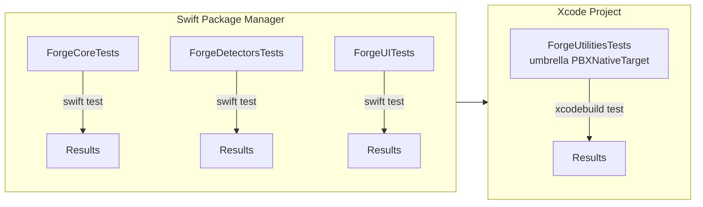

# Forge Testing Guide

> How we verify Forge. This document pairs with [ARCHITECTURE.md](./ARCHITECTURE.md) (system design) and [OPERATIONS.md](./OPERATIONS.md) (CI execution).

## Testing philosophy

We treat tests as a safety net, not a tax. Every boundary that could fail in production must be exercisable in isolation. Concretely:

- **Every detector is tested in isolation.** Detectors shell out to third-party binaries, filesystem locations, and environment variables. Unit tests replace the real world with a `MockCommandRunner` and a temporary directory so parsers are verified without requiring the tool to be installed.
- **Every cleanup action is tested with a fixture.** Cleanup touches user data, so we never run against `~/Library` in tests. Each action accepts an injectable `rootURL` that points to a temporary fixture tree.
- **Every protocol boundary has a mock implementation.** The UI depends only on protocols defined in `ForgeCore`, which means previews and snapshot tests can run with stub registries instead of real detectors.

This philosophy keeps CI fast, local debugging deterministic, and the app's failure modes observable.

## Test layout

Tests live next to the code they protect, inside each local Swift package:

```text
Packages/
  ForgeCore/Tests/ForgeCoreTests/
  ForgeDetectors/Tests/ForgeDetectorsTests/
  ForgeUI/Tests/ForgeUITests/
  ForgeUtilities/Tests/ForgeUtilitiesTests/
  ForgeUpdates/              # interface-only; no tests yet
```

`swift test` discovers and runs tests for any package that has a `.testTarget`. The Xcode project adds an extra layer for one package because of how SPM exposes test targets.



## Test categories

### Unit tests (`swift test` per package)

The bulk of the suite. These exercise pure logic, protocol conformances, and mock-driven workflows. They run in seconds and are the first line of defense on every pull request.

### Integration tests (`xcodebuild test` against the umbrella target)

Integration tests live in `ForgeUtilitiesTests` and exercise code that is wired into the Xcode project but not exported as an SPM test product. They verify that cleanup actions integrate with the real `FileManager` API against temporary fixtures.

### Preview tests (`DEBUG`-only `#Preview` blocks)

SwiftUI previews are lightweight, interactive tests. We keep previews deterministic by injecting `PreviewStubRegistry` and `PreviewStubPersistence` conformers. Previews must compile and render on every build; a broken preview is treated as a broken test.

### Snapshot tests (`ToolsViewSnapshotTests`)

`ForgeUI` ships one snapshot test that renders `ToolsView` in an empty state and compares it against a stored baseline. Snapshot tests catch unintended visual regressions but are intentionally narrow: they assert layout, not content, and they run only on the macOS destination used by CI.

## The umbrella test target pattern

SPM `.testTarget`s are built and run by `swift test`, but they are **not** exported as library products. The Xcode project cannot depend on a test target, so `xcodebuild test` would not discover `ForgeUtilitiesTests` if it were only an SPM test target.

Our fix is an umbrella `PBXNativeTarget` in `Forge.xcodeproj/project.pbxproj`:

- `PBXNativeTarget` UUID `4F10AD53839576568B9E5E13` is named `ForgeUtilitiesTests`.
- It links the `DerivedDataCleanupActionTests.swift` source file directly.
- It links the `ForgeUtilities` library product so the test target sees the implementation.
- The scheme `Forge` lists it as a testable target.

This pattern is a pragmatic workaround, not an architecture. If SPM ever supports test products for Xcode consumption, we will delete the umbrella target and let `swift test` handle everything. Until then, every new integration-style test that must run via `xcodebuild` needs an analogous umbrella target entry, added by the `xcodeproj` gem scripts.

## Mocking strategy

We mock at protocol boundaries. The four primary seams are:

| Protocol | Real implementation | Mock / stub | Used by |
|---|---|---|---|
| `CommandRunner` | `ProcessCommandRunner` | `MockCommandRunner` in `NodeDetectorTests` | `NodeDetector` parser tests |
| `DetectorRegistryProtocol` | `DetectorRegistry` actor | `PreviewStubRegistry` in `ToolsView` | SwiftUI previews |
| `PersistenceControllerProtocol` | `PersistenceController` | `PreviewStubPersistence` (in-memory `ModelContainer`) | SwiftUI previews + persistence tests |
| `CleanupActionProtocol` | `DerivedDataCleanupAction` | subclass / override `rootURL` to tmp dir | `DerivedDataCleanupActionTests` |

Mock implementations are kept in test source files or preview helper files, never in production code. This guarantees that production binaries ship only with real behavior.

### Example: `MockCommandRunner`

`NodeDetector` resolves Node through `/usr/bin/which node` and `node --version`. In tests we inject a runner that returns canned strings:

```swift
let runner = MockCommandRunner(responses: [
    "/usr/bin/which node": .init(stdout: "/opt/homebrew/bin/node\n", exitCode: 0),
    "/opt/homebrew/bin/node --version": .init(stdout: "v20.11.0\n", exitCode: 0)
])
let detector = NodeDetector(commandRunner: runner)
```

This lets us verify that the detector parses `"v20.11.0"` into a `SemVer(20, 11, 0)` without requiring Node to be installed.

## Test files inventory

| File | Package | What it covers |
|---|---|---|
| `Packages/ForgeCore/Tests/ForgeCoreTests/AppEnvironmentTests.swift` | ForgeCore | `live()` uses real `PersistenceController` when possible, falls back to `NoOpPersistenceController` (`AppEnvironment.swift:119`). |
| `Packages/ForgeCore/Tests/ForgeCoreTests/AsyncHelpersTests.swift` | ForgeCore | `parallelMap` preserves input order despite concurrent execution (`AsyncHelpers.swift:15`). |
| `Packages/ForgeCore/Tests/ForgeCoreTests/PersistenceControllerTests.swift` | ForgeCore | Save + fetch roundtrip with an in-memory `ModelContainer`; verifies SwiftData schema correctness. |
| `Packages/ForgeCore/Tests/ForgeCoreTests/ResultExtensionsTests.swift` | ForgeCore | `asyncMap` and `Result.init(catching:)` behavior. |
| `Packages/ForgeDetectors/Tests/ForgeDetectorsTests/DetectorRegistryTests.swift` | ForgeDetectors | `withTaskGroup` fan-out completes all detectors; timeout does not crash; per-detector failures are flattened (`DetectorRegistry.swift:36`). |
| `Packages/ForgeDetectors/Tests/ForgeDetectorsTests/NodeDetectorTests.swift` | ForgeDetectors | PATH-resolved Node, nvm fallback (`~/.nvm/versions/node/vX.Y.Z/bin/node`), and not-installed fallback. |
| `Packages/ForgeUI/Tests/ForgeUITests/ToolsViewSnapshotTests.swift` | ForgeUI | Empty-state snapshot of `ToolsView`. |
| `Packages/ForgeUtilities/Tests/ForgeUtilitiesTests/DerivedDataCleanupActionTests.swift` | ForgeUtilities | Missing dir returns empty report; three subdirs sum known sizes; symlinks are skipped; `TrashOnly` conformance is asserted. |

`ForgeUpdates` has no tests yet because it is interface-only: the three providers throw `UpdateProviderError.notImplemented`.

## Coverage strategy

We do not enforce an aggregated coverage gate in v1. Coverage is reviewed per package during code review. The plan is:

1. Keep test-to-production LOC ratio above 1.0 for non-UI packages.
2. Enable Xcode code coverage for `xcodebuild test` once the umbrella target pattern is stable.
3. Add `diff-cover` style PR gates in CI once we have a baseline.

Until then, reviewers use the inventory above as a checklist: if a new detector is added, a matching detector test must be added.

## How to run tests

### 1. Per-package `swift test`

```bash
cd Packages/ForgeDetectors
swift test
```

Best for tight feedback loops. Every package with tests supports this except `ForgeUtilities`, whose integration tests are surfaced only through Xcode.

### 2. Full Xcode build + test

```bash
xcodebuild test \
  -project Forge.xcodeproj \
  -scheme Forge \
  -destination 'platform=macOS' \
  -configuration Debug \
  CODE_SIGNING_ALLOWED=NO \
  CODE_SIGNING_REQUIRED=NO
```

This runs the umbrella target tests alongside the app target build and is what CI runs.

### 3. Targeted umbrella test

```bash
xcodebuild test \
  -project Forge.xcodeproj \
  -scheme Forge \
  -destination 'platform=macOS' \
  -only-testing:ForgeUtilitiesTests/DerivedDataCleanupActionTests \
  CODE_SIGNING_ALLOWED=NO \
  CODE_SIGNING_REQUIRED=NO
```

Use this when iterating on a single cleanup action.

## How to write a new test

For a new detector, follow this canonical flow:

1. Create `Packages/ForgeDetectors/Tests/ForgeDetectorsTests/<Tool>DetectorTests.swift`.
2. Implement `MockCommandRunner` responses for the tool's expected invocations.
3. Instantiate the detector with the mock runner.
4. Assert on the resulting `DetectionResult` fields: `toolId`, `version`, `installPath`, `diskUsageBytes`, `healthChecks`.
5. Add a failure case that asserts `DetectionError.notFound` or `DetectionError.malformedOutput`.

For a new cleanup action:

1. Conform to `CleanupActionProtocol` and, if trash-only, `TrashOnly`.
2. Accept an injectable `rootURL` in the initializer.
3. Create a temporary fixture directory in the test.
4. Assert the `DryRunReport` contains the expected paths and byte totals.
5. Never call `execute()` in unit tests; dry-run only.

## Concurrency testing

The current suite does not stress concurrency with a race detector. `DetectorRegistry` uses `withTaskGroup` to fan out detectors, and `parallelMap` does the same for collections. We verify functional correctness: all detectors complete, results are collected, and order is deterministic after sorting.

Future concurrency tests will:

- Launch many stub detectors in parallel and assert all complete.
- Use artificial delays (`Thread.sleep`) to amplify timing variance.
- Run with Thread Sanitizer / Swift Concurrency runtime checks enabled in CI.

## Anti-flaky rule

Tests must **never** assert the specific ordering of concurrently-produced results unless the code under test explicitly sorts them. `DetectorRegistry.scanAll()` sorts by `toolId.rawValue`; therefore it is safe to assert ordering. `scanAllTyped()` returns a dictionary, so tests must assert membership, not insertion order. This rule prevents flaky CI failures on slower runners.

## Future improvements

- **Swift Testing (`@Test`)**: Migrate from `XCTest` to Swift Testing as the framework stabilizes on macOS 14+. New tests can already use the `@Test` macro if they do not depend on XCTest-specific features.
- **Deterministic time provider**: Replace `Date()` in detectors and cleanup actions with a clock protocol so tests can assert exact `lastChecked` and `scannedAt` values.
- **CI integration with `xcresult` bundles**: Upload `.xcresult` artifacts from CI and surface them in PR comments for easier failure diagnosis.
- **Thread Sanitizer in CI**: Add a nightly job that runs the full suite with TSan enabled.

## Risks

| Risk | Impact | Mitigation |
|---|---|---|
| Test target not discoverable via `xcodebuild test` | High | Umbrella `PBXNativeTarget` pattern documented above and verified in CI. |
| Snapshot tests break on SwiftUI version bumps | Medium | Regenerate baselines on Xcode upgrades; pin CI to `/Applications/Xcode_26.5.app`. |
| Mock drift from real behavior | Medium | Each detector has at least one integration test guarded by `XCTSkipUnless` so CI skips when the tool is absent but still validates when present. |
| Flaky concurrency tests | Medium | Anti-flaky rule: assert sorted order only when the implementation sorts; otherwise assert membership. |
| Coverage blind spots in UI layer | Low | Snapshot tests cover rendering; future UI tests will exercise interactions. |

## Future scalability

As Forge grows from 1 detector to 12+ and from 1 cleanup action to many, the test surface scales with package count rather than app size. The same patterns scale horizontally:

- New detectors get their own `*DetectorTests.swift` files using `MockCommandRunner`.
- New cleanup actions get temporary-fixture tests using injectable `rootURL`.
- New packages follow the umbrella target pattern if they require `xcodebuild` integration.
- CI will shard by package once build times exceed 10 minutes.

For related decisions, see [ADR.md](./ADR.md). For how tests run in CI, see [OPERATIONS.md](./OPERATIONS.md).
